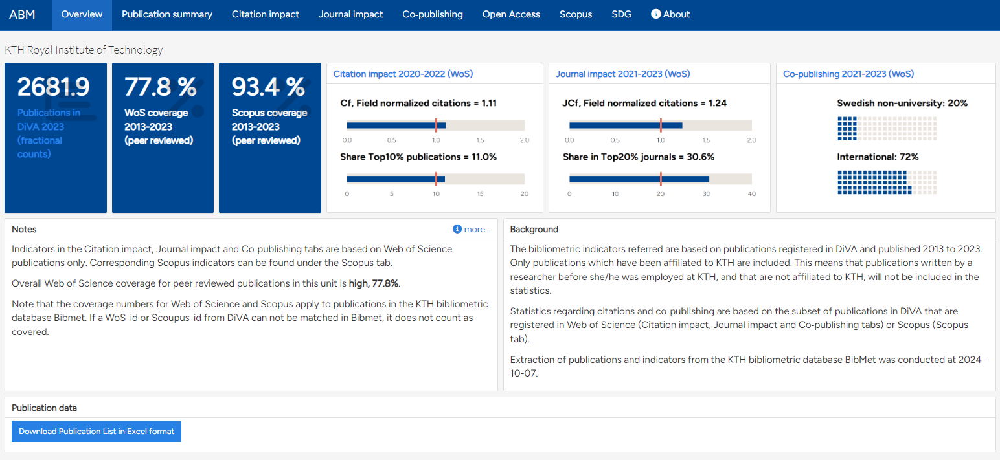
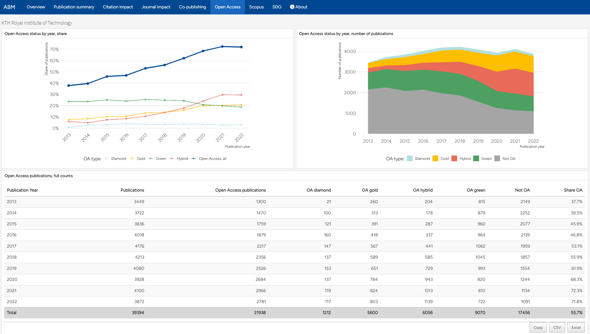

```{r setup, include=FALSE}
library(knitr)
library(rmdformats)

## Global options
options(max.print="75")
opts_chunk$set(echo=FALSE,
	             cache=TRUE,
               prompt=FALSE,
               tidy=TRUE,
               comment=NA,
               message=FALSE,
               warning=FALSE)
opts_knit$set(width=75)
```

# Background

## What is the aim of ABM at KTH?

The Annual Bibliometric Monitoring at KTH (shortened to ABM) contains statistics on publication output, citation impact and co-publishing. The ABM, together with goals regarding publishing and citation will be a part of the schools’ operational agreements and to be followed up in the school dialogues. It can be used as a basis for understanding how one’s own activities contribute to this goal. 

## Which publications are included in ABM?

Only publications registered in DiVA that researchers have published when working at KTH are included. 

Only KTH-affiliated publications are taken into account.

## At what organizational levels is it available?

The ABM is available at different levels, for KTH in total, schools, departments and individual researchers. Results for the schools and departments are open for all, but to see the individual ABM you will need to login. The report is the same at all levels.

## What data sources is it based on?

ABM is based on data in BIBMET, which in turn collates data from other reference sources, including Web Of Science and Scopus. Statistics regarding citations and co‑publishing are based on the subset of publications in DiVA that are registered in Web of Science (Citation impact, Journal impact and Co‑publishing tabs) or Scopus (Scopus tab).

The bibliometric indicators referred are based on publications registered in DiVA and published 2013 to 2019. Only publications which have been affiliated to KTH are included. This means that publications written by a researcher before she/he was employed at KTH, and that are not affiliated to KTH, will not be included in the statistics.

# Contact information

If you have questions about the ABM at KTH please contact <mailto:biblioteket@kth.se>

This form can also be used to submit a question:

- https://www.kth.se/biblioteket/anvanda-biblioteket/oppettider-kontakt/kontaktformular-1.863120

Read more about other ways to get in touch here:

- https://www.kth.se/biblioteket/anvanda-biblioteket/oppettider-kontakt

# Accessibility

We aim at providing content in an accessible fashion in compliance with [WCAG 2.1](https://www.w3.org/TR/WCAG21/){target="_blank"}, and are aware that there is room for improvement for some of the content.

If you require access to content not provided in a format that is accessible for you, please contact us at [biblioteket@kth.se](mailto:biblioteket@kth.se). Please find more information about accessibility at KTH here: [KTH Web Accessibility Web Page](https://www.kth.se/gemensamt/tillganglighet){target="_blank"}

# Further information

- [Introduction to bibliometrics at KTH](Bibliometrics.html){target="_blank"}
- [Description of data, methods and indicators in KTH Annual Bibliometric Monitoring](Description_data_and_methods_ABM.pdf){target="_blank"}
- [Information about DiVA and the registration process - Handle publications in DiVA](https://www.kth.se/en/biblioteket/publicera-analysera/hantera-publikationer){target="_blank"}
- [President decision about the Annual Bibliometric Monitoring](Beslut_ABM.html){target="_blank"}
- [Report on Open Access publishing at KTH](OARapport.pdf){target="_blank"}
- [Formal definitions of field normalized citation indicators at KTH](indicators.html){target="_blank"}

For further questions, contact the KTH Library at [biblioteket@kth.se](mailto:biblioteket@kth.se).

## Attribution for third-party data sources

### Redistribution rights for Web Of Science data

Certain data included in the Annual Bibliometric Monitoring report are derived from the © Science Citation Index Expended (SCIE), Social Sciences Citation Index (SSCI), Arts & Humanities Citation Index (AHCI), Conference Proceedings Citation Index - Sciences (CPCI-S) and Conference Proceedings Citation Index - Social Sciences & Humanities (CPCI -SSH) (2021) of Clarivate Analytics (US) LLC. All rights reserved. No part of these materials may be reproduced, stored in a retrieval system or transmitted in any form or by any means, including electronic, mechanical, photographic, magnetic or other means without the expressed permission of the KTH Library.

# User Guide

This guide gives an introduction to the Annual Bibliometric Monitoring
(ABM) at KTH Royal Institute of Technology. The purpose of the guide is
to help you navigate the presentation of results, to understand the
bibliometric indicators used in the report, and to interpret the
results. More detailed description of indicators and methods are found
in [*Description of methods, data and indicators in KTH Annual Bibliometric Monitoring*](https://kth-library.github.io/abm/Description_data_and_methods_ABM.pdf).

## Background 

The aim of the ABM is to assist monitoring, research evaluation and
quality assurance at KTH, but also to provide KTH organizations and
researchers with information related to their publications. The ABM was
introduced in 2013 and was published annually in the same format since
then. In 2019, a project aiming to redesign and develop the ABM was
started. This resulted in the current solution, maintaining the same
information as in previous years but in a more flexible framework with a
presentation that is more dynamic, extendable and easier to maintain.
That is the version of ABM described here.

The ABM results are available at different levels, for KTH in total,
Schools, Departments and for individual researchers. The report
currently has the same format and contents at all levels. Data is
presented for the last 6 years with a complete publication record, which
in practice means the year before last autumn and the five preceding
years (i.e. in the spring of 2021, the ABM contains data for the
publication years 2013-2019).

Only publications registered in DiVA and affiliated with KTH are
included in the results (i.e. publications that KTH researchers have
published at other organizations are excluded). Affiliations to KTH are
based on the actual author affiliation as written in the published
paper. All citation data and derived indicators are based on Web of
Science[^1], and indicators are therefore only presented for
publications covered by Web of Science.

If a School or Department have changed name or the organizational
structure has in any other way changed, publications affiliated to old
organizational units have been assigned to the corresponding current
unit when possible.

## Overview

The *Overview* tab includes key indicators displayed for the latest
available time period[^2] and general information about ABM and
publication activities at KTH. For organizational units, there is also a
button leading to the unit's publications at
[altmetric.com](https://altmetric.com).

Most numbers on this tab are based on fractionalized counts, i.e. an
author's share of a publication is counted as 1/n where n denotes the
number of authors. The exception is the *Copublication* charts, which
are based on full counts.

The overview at the KTH, school and department level is available to
everyone, except for the button for publication list download which is
only available for logged in KTH users.

{width=100%}


The individual view, only available to the researcher, also includes a
link to edit publications in DiVA.

{width=100%}

## Publications in DiVA

The *Publications in DiVA* tab shows the number of publications
registered in DiVA for the researcher or organizational unit, by year
and by publication type. Web of Science (WoS) coverage is also shown for
each publication type. The validity of bibliometric indicators is in
general higher if the share of publications covered is high. Results
based on publications with a smaller share covered in WoS should be
treated with caution.

All numbers on this tab are based on fractionalized counts. The graphs
show the same information as the table.

{width=100%}

## Citation impact

The *Citation impact* tab shows citation impact for the
researcher's/unit's publications. All numbers on this tab are based on
fractionalized counts.

The first table in this view shows the total and average number of
citations after three years, i.e. citations received in the publication
year and the two directly following years, as well as the number and
share of publications that were not cited in that time. This table is
based on the Web of Science document types Article, Proceedings paper,
Review, Letter and Editorial.

The second table is based on the Web of Science document types Article
and Review, and shows Field Normalized Citations (Cf) and the
number/share of publications belonging to the 10 percent most cited in
its field.

The normalization is done so that the citation value for each
publication is divided by the average number of citations received by
publications from the same year, within the same Web of Science category
(or categories) and of the same document type. For more detailed
descriptions of the field normalized indicators used at KTH, see [Formal
definitions](https://kth-library.github.io/abm/Formal_definitions_field_normalized_citation.pdf).

Mean-based citation indicators (such as Cf) can be strongly affected by
a single publication (or a few) with a very high citation count relative
to its field, while the Share Top 10% indicator is less sensitive to
outliers. In that sense, Cf and Share Top 10% are complementary. Since
field normalized indicators are unstable at low publication counts, this
table is presented with overlapping three-year periods. Indicators based
on a small number of publications should still be interpreted with
caution.

{width=100%}

## Journal impact

The *Journal impact* tab shows the average citation impact of the
journals where researcher's/unit's have published their publications.
All numbers on this tab are based on fractionalized counts.

The table shows the average Journal Field Normalized Citations (JCf) and
the number/share of publications in the 20 percent most cited journals
in its Web of Science subject category/categories. This table is based
on the publication types Article and Review.

The JCf and Share Top 20% indicators supplement each other the same way
as the Cf and Share Top 10% indicators. By evaluating the impact of the
journals rather than the publications themselves, these indicators
supplement the picture of the publishing profile, and the journal
indicators are often seen as a proxy of the quality of publication
channels. JCf is also used as a part of the model for allocating KTH
funding to the schools.

{width=100%}

## Co-publishing 

The *Co-publishing* tab shows the level of co-publication with
universities and other organizations. All numbers on this tab are based
on the Web of Science categories Article and Review and use full counts,
i.e. a publication is counted as one even if there are many co-authors.

Here, a Swedish non-university co-publication means a publication with
at least one address belonging to a Swedish organization outside
academia while an International co-publication is a publication with at
least two countries in the Web of Science addresses field.

{width=100%}

## Open Access

The *Open Access* tab shows the OA status of publications according to
[Unpaywall](https://unpaywall.org). For a publication to be included, it
needs to be marked as a peer reviewed publication in DiVA and have a
Digital Object Identifier (DOI) that Unpaywall can recognice and
determine an OA status for.

The statuses are presented as defined by Unpaywall. For further
information, see "[What do the types of oa status
mean?](https://support.unpaywall.org/support/solutions/articles/44001777288-what-do-the-types-of-oa-status-green-gold-hybrid-and-bronze-mean-)" at the unpaywall.org support portal.

{width=100%}

[^1]: Included indices: Science Citation Index Expended (SCIE), Social
    Sciences Citation Index (SSCI), Arts &Humanities Citation Index
    (AHCI), Conference Proceedings Citation Index -Sciences (CPCI-S) and
    Conference Proceedings Citation Index -Social Sciences & Humanities
    (CPCI -SSH)

[^2]: Last year with a complete publication record in DiVA (usually year
    of last autumn -- 1), with a non-zero count, for the Total
    publications number, the full period for WoS coverage and last
    three-year period with an indicator for the other numbers.