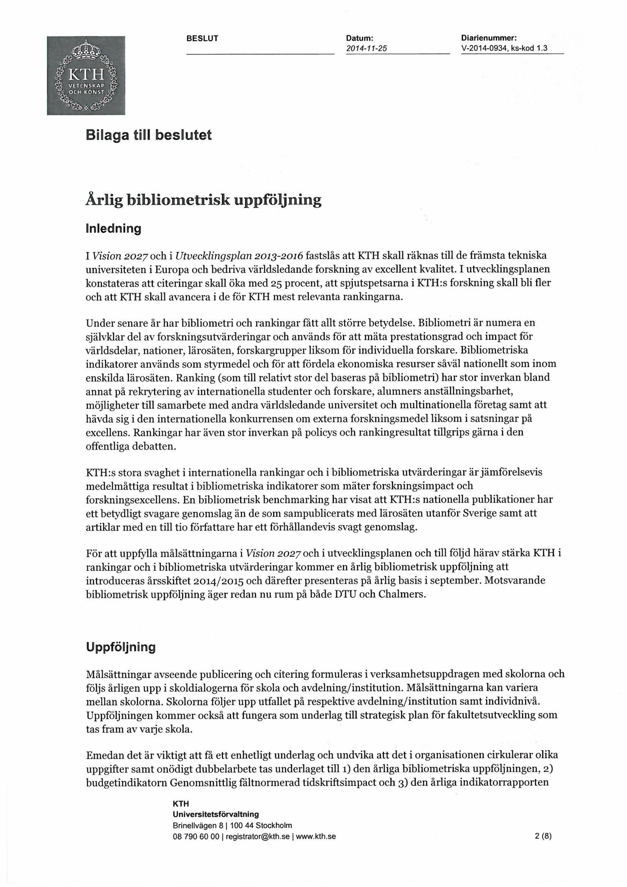
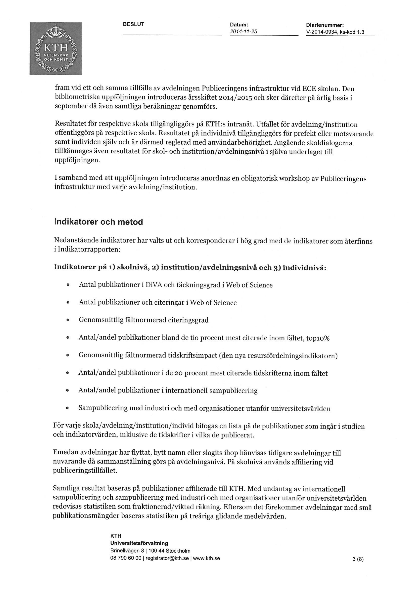
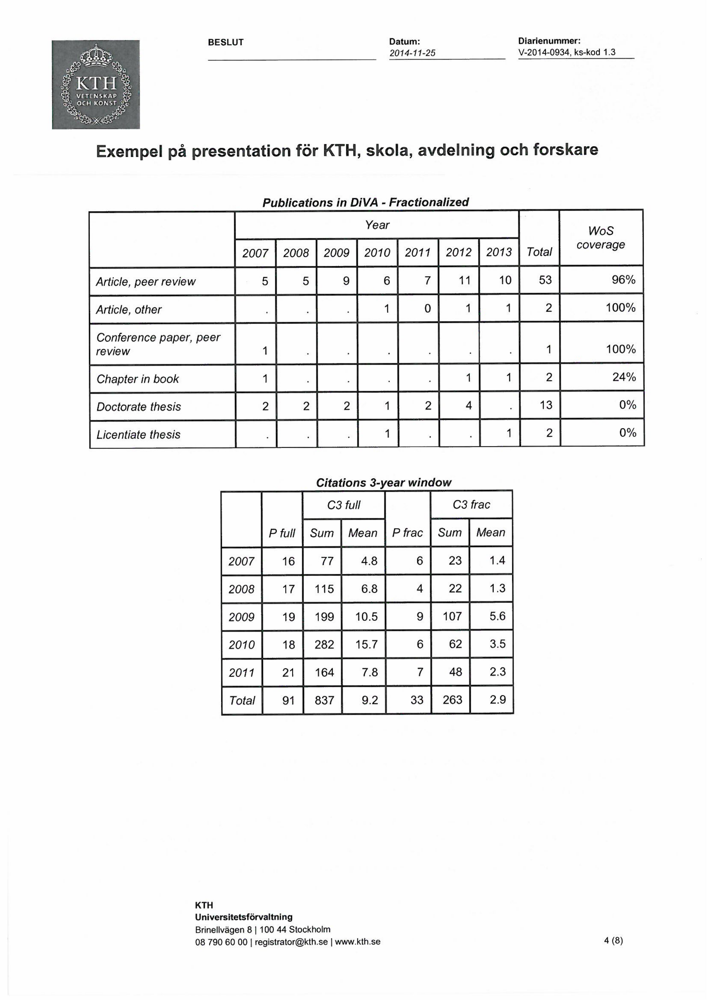
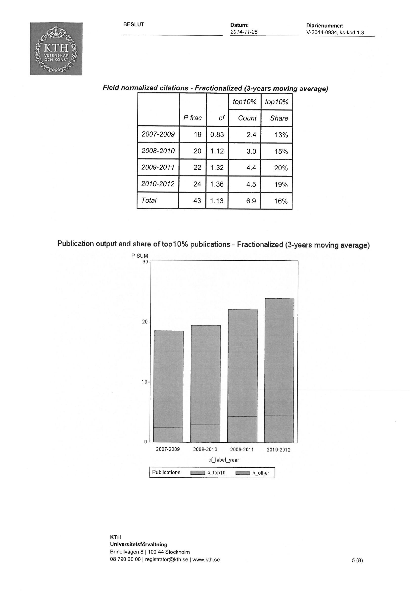
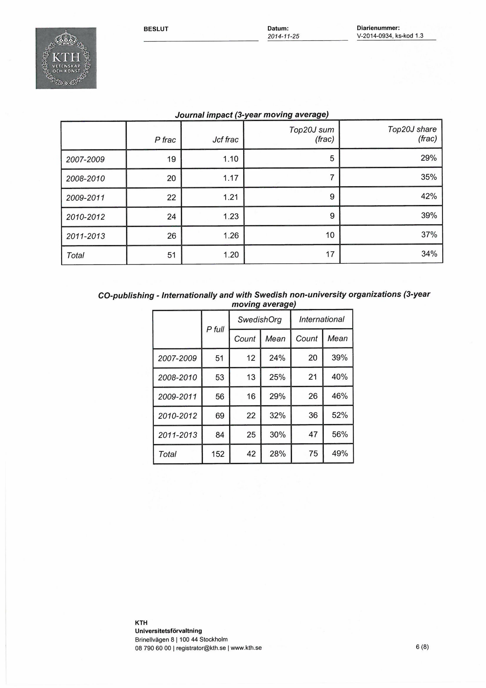
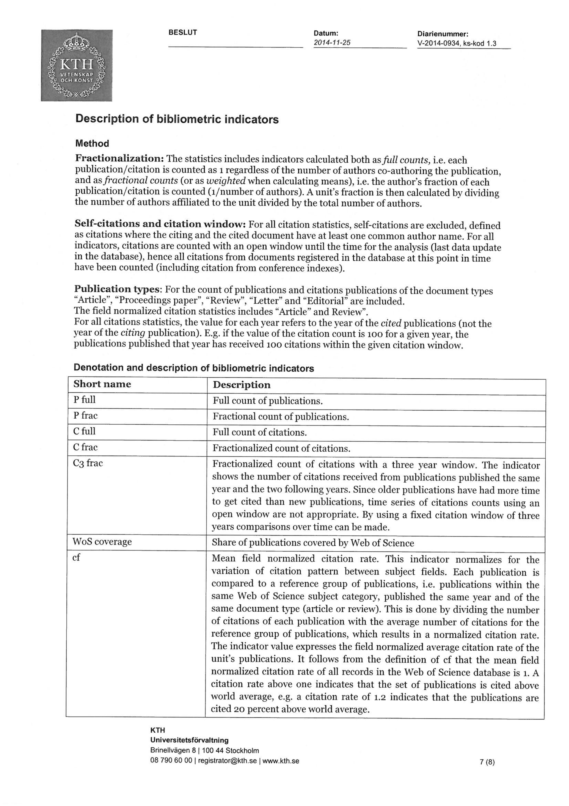
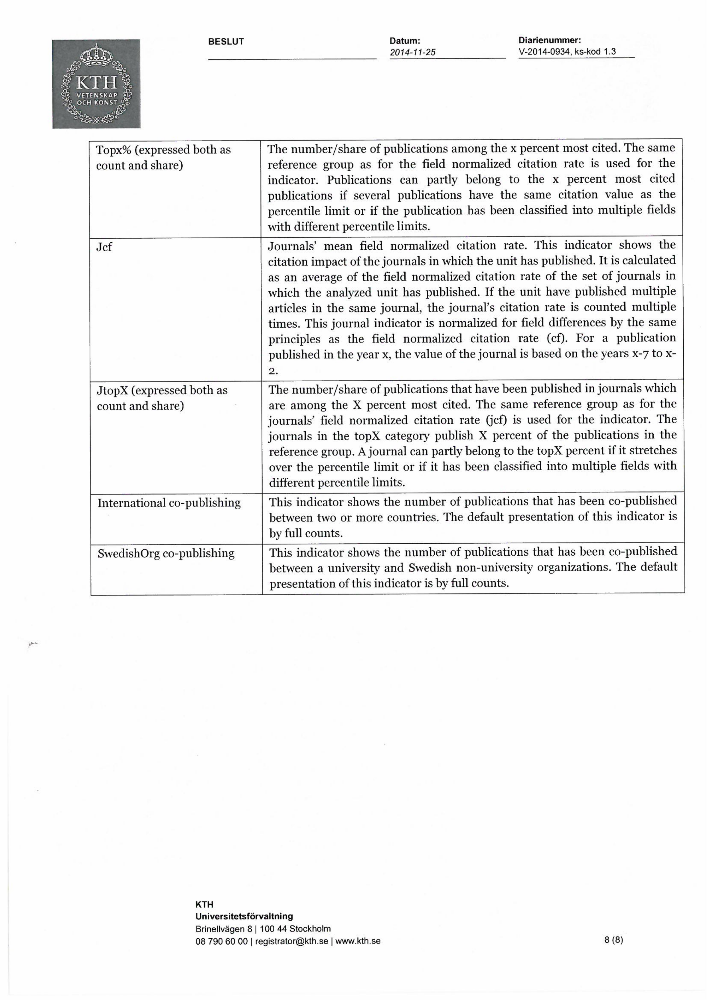

```{r setup, include=FALSE}
library(knitr)
library(rmdformats)

## Global options
options(max.print="75")
opts_chunk$set(echo=FALSE,
	             cache=TRUE,
               prompt=FALSE,
               tidy=TRUE,
               comment=NA,
               message=FALSE,
               warning=FALSE)
opts_knit$set(width=75)
```

> Nedan följer de viktigaste delarna av materialet i orginalhandlingarna (bifogade längre ned, i bildformat) i klartext av tillgänglighetsskäl.

## Metadata

Datum: 2014-11-25

Diarienummer: V-2014-0934

Beslutat av: Rektor 

Datum: 141209

Föredragande: Per-Anders Östling, UF/PLU Skolchef ECE

För åtgärd: Skolchef ECE, Avdelningen för Publiceringens infrastruktur ECE, UF/PLU

Övriga närvarande:

- Vicerektor Arne Johadisson i Skolcheferna
- Förvaltningschef Ariders Lundgren r ÖRA
- Peter Sjögårde, Publiceringens infrastruktur ECE Hl 7 Ne r da

## Beslut

Rektor beslutar att en årlig bibliometrisk uppföljning introduceras årsskiftet 2014/2015 och därefter
presenteras på årlig basis i september. Målsättningar avseende publicering och citering formuleras i
verksamhetsuppdragen med skolorna och följs årligen upp i skoldialogerna. Skolorna följer upp utfallet
på respektive avdelning/institution samt individnivå.

## Bakgrund

I Utvecklingsplan 2013-2016 fastslås att KTH skall räknas till de främsta tekniska universiteten i
Europa och bedriva världsledande forskning av excellent kvalitet. I utvecklingsplanen konstateras att
citeringar skall öka med 25 procent, att spjutspetsarna i KTH:s forskning skall bli fler och att KTH skall
avancera i de för KTH mest relevanta rankingarna.

Bibliometri och ranking har under senare år fått allt större betydelse. Bibliometri är numera en
självklar del av rankingar och av forskningsutvärderingar och används för att mäta prestationsgrad och
impact samtidigt som ranking fått allt större betydelse inom en rad områden som är av strategisk
betydelse för KTH.

För att uppfylla ovannämnda målsättningar och stärka KTH ställning i rankingar och i bibliometriska
utvärderingar introduceras därför en årlig bibliometrisk uppföljning.

Vid protokollet

Per-Anders Östling
KTH
Universitetsförvaltning
Brinellvägen 8 | 100 44 Stockholm
08 790 60 00 | registratorQkth.se | www.kth.se 

# Bilaga till beslutet

## Årlig bibliometrisk uppföljning

### Inledning

I Vision 2027 och i Utvecklingsplan 2013-2016 fastslås att KTH skall räknas till de främsta tekniska
universiteten i Europa och bedriva världsledande forskning av excellent kvalitet. I utvecklingsplanen
konstateras att citeringar skall öka med 25 procent, att spjutspetsarna i KTH:s forskning skall bli fler
och att KTH skall avancera i de för KTH mest relevanta rankingarna.
Under senare år har bibliometri och rankingar fått allt större betydelse. Bibliometri är numera en
självklar del av forskningsutvärderingar och används för att mäta prestationsgrad och impact för
världsdelar, nationer, lärosäten, forskargrupper liksom för individuella forskare. Bibliometriska
indikatorer används som styrmedel och för att fördela ekonomiska resurser såväl nationellt som inom
enskilda lärosäten. Ranking (som till relativt stor del baseras på bibliometri) har stor inverkan bland
annat på rekrytering av internationella studenter och forskare, alumners anställningsbarhet,
möjligheter till samarbete med andra världsledande universitet och multinationella företag samt att
hävda sig i den internationella konkurrensen om externa forskningsmedel liksom i satsningar på
excellens. Rankingar har även stor inverkan på policys och rankingresultat tillgrips gärna i den
offentliga debatten.

KTH:s stora svaghet i internationella rankingar och i bibliometriska utvärderingar är jämförelsevis
medelmåttiga resultat i bibliometriska indikatorer som mäter forskningsimpact och
forskningsexcellens. En bibliometrisk benchmarking har visat att KTH:s nationella publikationer har
ett betydligt svagare genomslag än de som sampublicerats med lärosäten utanför Sverige samt att
artiklar med en till tio författare har ett förhållandevis svagt genomslag.
För att uppfylla målsättningarna i Vision 2027 och i utvecklingsplanen och till följd härav stärka KTH i
rankingar och i bibliometriska utvärderingar kommer en årlig bibliometrisk uppföljning att
introduceras årsskiftet 2014/2015 och därefter presenteras på årlig basis i september. Motsvarande
bibliometrisk uppföljning äger redan nu rum på både DTU och Chalmers.

### Uppföljning

Målsättningar avseende publicering och citering formuleras i verksamhetsuppdragen med skolorna och
följs årligen upp i skoldialogerna för skola och avdelning/institution. Målsättningarna kan variera
mellan skolorna. Skolorna följer upp utfallet på respektive avdelning/institution samt individnivå.
Uppföljningen kommer också att fungera som underlag till strategisk plan för fakultetsutveckling som
tas fram av varje skola.

Emedan det är viktigt att få ett enhetligt underlag och undvika att det i organisationen cirkulerar olika
uppgifter samt onödigt dubbelarbete tas underlaget till 1) den årliga bibliometriska uppföljningen, 2)
budgetindikatorn Genomsnittlig fältnormerad tidskriftsimpact och 3) den årliga indikatorrapporten
fram vid ett och samma tillfälle av avdelningen Publiceringens infrastruktur vid ECE skolan. Den
bibliometriska uppföljningen introduceras årsskiftet 2014/2015 och sker därefter på årlig basis i
september då även samtliga beräkningar genomförs.

Resultatet för respektive skola tillgängliggörs på KTH:s intranät. Utfallet för avdelning/institution
offentliggörs på respektive skola. Resultatet på individnivå tillgängliggörs för prefekt eller motsvarande
samt individen själv och är därmed reglerad med användarbehörighet. Angående skoldialogerna
tillkännages även resultatet för skol- och institution/avdelningsnivå i själva underlaget till
uppföljningen.

I samband med att uppföljningen introduceras anordnas en obligatorisk workshop av Publiceringens
infrastruktur med varje avdelning/institution.

### Indikatorer och metod

Nedanstående indikatorer har valts ut och korresponderar i hög grad med de indikatorer som återfinns
i Indikatorrapporten:

Indikatorer på 1) skolnivå, 2) institution/avdelningsnivå och 3) individnivå:

- Antal publikationer i DiVA och täckningsgrad i Web of Science
- Antal publikationer och citeringar i Web of Science
- Genomsnittlig fältnormerad citeringsgrad
- Antal/andel publikationer bland de tio procent mest citerade inom fältet, top1026
- Genomsnittlig fältnormerad tidskriftsimpact (den nya resursfördelningsindikatorn)
- Antal/andel publikationer i de 20 procent mest citerade tidskrifterna inom fältet
- Antal/andel publikationer i internationell sampublicering
- Sampublicering med industri och med organisationer utanför universitetsvärlden

För varje skola/avdelning/institution/individ bifogas en lista på de publikationer som ingår i studien
och indikatorvärden, inklusive de tidskrifter i vilka de publicerat.

Emedan avdelningar har flyttat, bytt namn eller slagits ihop hänvisas tidigare avdelningar till
nuvarande då sammanställning görs på avdelningsnivå. På skolnivå används affiliering vid
publiceringstillfället.

Samtliga resultat baseras på publikationer affilierade till KTH. Med undantag av internationell
sampublicering och sampublicering med industri och med organisationer utanför universitetsvärlden
redovisas statistiken som fraktionerad/viktad räkning. Eftersom det förekommer avdelningar med små
publikationsmängder baseras statistiken på treåriga glidande medelvärden.

## Description of bibliometric indicators

### Method

Fractionalization: The statistics includes indicators calculated both as full counts, i.e. each
publication/citation is counted as 1 regardless of the number of authors co-authoring the publication,
and as fractional counts (or as weighted when calculating means), i.e. the author's fraction of each
publication/citation is counted (1/number of authors). A unit's fraction is then calculated by dividing
the number of authors affiliated to the unit divided by the total number of authors.

Self-citations and citation window: For all citation statistics, self-citations are excluded, defined
as citations where the citing and the cited document have at least one common author name. For all
indicators, citations are counted with an open window until the time for the analysis (last data update
in the database), hence all citations from documents registered in the database at this point in time
have been counted (including citation from conference indexes).

Publication types: For the count of publications and citations publications of the document types
”Article”, "Proceedings paper”, "Review”, Letter” and "Editorial” are included.
The field normalized citation statistics includes ”Article” and Review”.
For all citations statistics, the value for each year refers to the year of the cited publications (not the
year of the citing publication). E.g. if the value of the citation count is 100 for a given year, the
publications published that year has received 100 citations within the given citation window.

### Denotation and description of bibliometric indicators

*P full Full count of publications.*

- Fractional count of publications.

*C full Full count of citations.*

- Fractionalized count of citations.

*C3 frac* 

- Fractionalized count of citations with a three year window. The indicator
shows the number of citations received from publications published the same
year and the two following years. Since older publications have had more time
to get cited than new publications, time series of citations counts using an
open window are not appropriate. By using a fixed citation window of three
years comparisons over time can be made.

*WoS coverage*

- Share of publications covered by Web of Science

*cf* 

- Mean field normalized citation rate. This indicator normalizes for the
variation of citation pattern between subject fields. Each publication is
compared to a reference group of publications, i.e. publications within the
same Web of Science subject category, published the same year and of the
same document type (article or review). This is done by dividing the number
of citations of each publication with the average number of citations for the
reference group of publications, which results in a normalized citation rate.
The indicator value expresses the field normalized average citation rate of the
unit's publications. It follows from the definition of cf that the mean field
normalized citation rate of all records in the Web of Science database is 1. A
citation rate above one indicates that the set of publications is cited above
world average, e.g. a citation rate of 1.2 indicates that the publications are
cited 20 percent above world average.

*Topx% (expressed both as count and share)*

- The number/share of publications among the x percent most cited. The same
reference group as for the field normalized citation rate is used for the
indicator. Publications can partly belong to the x percent most cited
publications if several publications have the same citation value as the
percentile limit or if the publication has been classified into multiple fields
with different percentile limits.

*Jcf* 

- Journals” mean field normalized citation rate. This indicator shows the
citation impact of the journals in which the unit has published. It is calculated
as an average of the field normalized citation rate of the set of journals in
which the analyzed unit has published. If the unit have published multiple
articles in the same journal, the journal's citation rate is counted multiple
times. This journal indicator is normalized for field differences by the same
principles as the field normalized citation rate (cf). For a publication
published in the year x, the value of the journal is based on the years x-7 to x-
St

*JtopX (expressed both as count and share)*

- The number/share of publications that have been published in journals which
are among the X percent most cited. The same reference group as for the
journals” field normalized citation rate (jef) is used for the indicator. The
journals in the topX category publish X percent of the publications in the
reference group. A journal can partly belong to the topX percent if it stretches
over the percentile limit or if it has been classified into multiple fields with
different percentile limits.

*International co-publishing*

- This indicator shows the number of publications that has been co-published
between two or more countries. The default presentation of this indicator is
by full counts.

*SwedishOrg co-publishing*

- This indicator shows the number of publications that has been co-published
between a university and Swedish non-university organizations. The default
presentation of this indicator is by full counts.

# Originalhandlingar

{width=100%}
{width=100%}
{width=100%}
{width=100%}
{width=100%}
{width=100%}
{width=100%}
