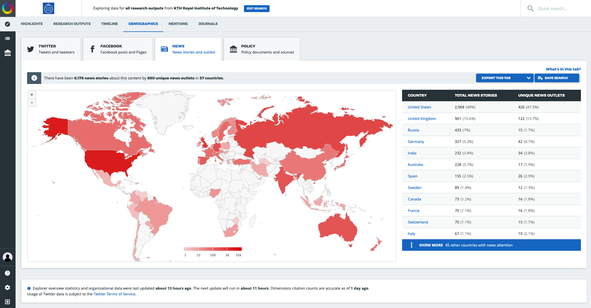

```{r setup, include=FALSE}
knitr::opts_chunk$set(echo = FALSE)
knitr::opts_chunk$set(cache = TRUE)
library(webshot)
#webshot::install_phantomjs()
#unlink("retrosearch-screenshot.png")

suppressPackageStartupMessages(library(magick))

```

# Demo ÅBU 1.2+ {data-background="background.png" data-background-size="center bottom"}

## Possible development of ÅBU 1.2+ 

The ÅBU - Annual Bibliometric Monitoring - is sometimes perceived as a annual reporting event for __ranking and evaluating research publications__ at KTH. 

Amongst some researchers it can be perceived as an employee review tool... and it sounds from those who have done it, that it has __not always been a pleasant experience__ to present the ÅBU to some stakeholders.

> The Bibliometrics group has thought about how it could be developed further, in the future, to __bring more value to the different stakeholders__.

## Examples of ÅBU stakeholders at KTH

- Individual researchers - focused on understanding __their own research impact__ and improving it
- KTH management staff - focused on __KTH ranking and improving KTH at organizational levels__. Can use ÅBU as a tool in order to make KTH even more attractive in rankings when building careers that can make KTH even better in the future and at employee reviews. 
- Bibliometrics staff - focused on __providing high quality analytics__ to be used within KTH and to author and develop good and relevant Bibliometrics analytics (data, visuals, tools) in collaboration with others in the Bibliometrics domain (even outside of the KTH Library).

## Adding value in ÅBU for researchers (1/2)

- Existing indicators used at aggregate levels are __not good at individual level__ (low n < 50). The Bibliometrics group want to use better indicators which are more suitable as indicators at the individual level.

- Add more "altmetrics" for individual researchers for a broader view of their impact. __"How can I track my own citations? In what countries are the publications made? Where should I publish?"__. Data sources: Altmetric (R package `rAltmetric`). Mendeley (R packages `RMendeley`).

## Adding value in ÅBU for researchers (2/2)

- Which countries and universities do researchers __co-publish__ with? Who cites them? Data source: WoS documents. These have addresses which could be used to show which countries researchers have collaborated with.

- Add more data related to __Open Access__ publications. Data sources: DOAJ  - Directory of Open Access Journals - provides free and open data and metadata of relevance for open access journal publications (data dumps are available). Unpaywall free and open API provides data. (R package `roadoi` can be used).

## Adding value in ÅBU for KTH management staff

- We will show some examples later. But importantly, what are YOUR own ideas?

Some possibilities:

- Everything advantageous for individual researchers can be aggregated at higher levels
- Make reporting on Open Access publications and associated fees from __Directory of Open Access Journals (DOAJ)__ available
- Make reporting on ranking for KTH and comparisons within Sweden and perhaps Europe available

## Adding value with the KTHB team

Ideas:

- Collaboration with __other Bibliometrics efforts outside of KTH__ can inspire work and improve the analytics quality even more.
- There are nice __examples of open sourced and publicly available work__ in the Bibliometrics domain, which can be used and serve as inspiration when developing analytics.
- For working with people in the Bibliometrics domain, __GitHub and DockerHub are great collaboration tools__ that can reach far outside of the KTH Bibliometrics group. 

# Examples follow...

## Finnish ÅBU example

Who is Tuija Sonkkila, from Finland? She is working at Aalto University Leadership Support Services. Altmetrics, SQL, Power BI, QlikView, data wrangling. She has written a paper on [Metrics, Altmetrics, Data Visualization](https://docs.lib.purdue.edu/cgi/viewcontent.cgi?article=2046&context=iatul)

She has developed **Shiny apps** covering bibliometrics analytics for Aalto University. She also produces analytics and reporting on other things like **staff mobility**: https://github.com/tts/mobility2018

[Tuijas web page](https://blogs.aalto.fi/suoritin/) and private blog at [](https://tuijasonkkila.fi/blog).

## Finnish ÅBU example {.smaller}

[{height=450px}](https://ttso.shinyapps.io/aaltovirta/)

## Other examples of Tuija's public work

Here are some links to her open source work, based on R, often using Shiny:

- https://github.com/tts/aaltoaltmetrics
- https://blogs.aalto.fi/suoritin/2015/07/02/looking-at-keywords-in-ref2014-impact-case-studies/
- https://github.com/tts/aaltoced4pureconf
- https://github.com/tts/opencitations/blob/master/query.R
- https://github.com/tts/aaltovirta
- https://github.com/tts/altm2016top100
- https://github.com/tts/aaltoaltmetrics

# Visual examples 

## ÅBU 1.2+ possible changes
 
A couple of visual examples follow, involving use of open source based tools and visualizations that are web-friendly and responsive and interactive.

We will show how usage of visualizations such as maps, open access data sources and other modern analytics tools could be used to develop the ÅBU report in the future (v 1.2+)

## Altmetrics (1/2)

[{height=450px}](https://www.altmetric.com/explorer/demographics?filter=msm)

## Altmetrics (2/2) 

[{height=450px}](https://www.altmetric.com/explorer/outputs?show_details=208908)

## Map of Swedish publications > ~ 1980 (WoS)

```{r}
library(leaflet)

markers <- read.csv('geodata.csv')

m <-
  leaflet(data = markers) %>%
  addTiles(
    urlTemplate = "//{s}.basemaps.cartocdn.com/light_all/{z}/{x}/{y}{r}.png", 
    options = tileOptions(maxZoom = 18), group = "Gray", layerId = "test"
  )

getMyIcon <- function(npubs){
    if (npubs < 100) {markColor <- 'lightgreen'}
    else if (npubs < 1000) {markColor <- 'green'}
    else if (npubs < 50000) {markColor <- 'orange'}
    else {markColor <- 'red'}
    return(awesomeIcons(icon = 'book', iconColor = 'black', library = 'glyphicon', markerColor = markColor))
}

for (j in 1:length(markers$name)) {
    m <- addAwesomeMarkers(m, lng=as.numeric(markers$longitude[j]), lat=as.numeric(markers$latitude[j]), popup=paste(markers$artiklar[j],"publications <br> in",markers$name[j]), icon=getMyIcon(markers$artiklar[j]), options = markerOptions(npubs=markers$artiklar[j]), clusterOptions = markerClusterOptions(maxClusterRadius=120, iconCreateFunction=JS("function (cluster) {
    var markers = cluster.getAllChildMarkers();
    var count = 0;
    for( var i = 0; i<markers.length; i++ ) {
      count = count + markers[i].options.npubs;
    }
    var c = ' marker-cluster-';
    if (count < 1000) {  
      c += 'small';  
    } else if (count < 50000) {  
      c += 'medium';  
    } else { 
      c += 'large';
    }
    return new L.DivIcon({ html: '<div><span>' + count + '</span></div>', className: 'marker-cluster' + c, iconSize: new L.Point(40, 40) });

  }")), clusterId = "cluster1")
}

m

```


## OA Publications - Costs (EUR) from OpenAPC{.smaller}

```{css}
.rpivotTable
    {
    overflow-x: auto;
    overflow-y: auto;
    }
```

```{r, message=FALSE, out.width="100%", out.height="90%"}

library(rpivotTable)
library(readr)
library(dplyr)

apc_se_rich <- paste0(
    "https://raw.githubusercontent.com/OpenAPC/openapc-de/master/data/openapc-se/",
    "apc_se_enriched.csv"
  )

df <- 
  apc_se_rich %>%
  read_csv() %>%
  filter(!is.na(doi))

df2 <- 
  df %>% 
  select(
    Institution = "institution",
    Period = "period", 
    Euro = "euro",
    Publisher = "publisher",
    Journal = "journal_full_title",
    DOAJ = "doaj"
  )


rpivotTable(
  data = df2, width="100%", height="450px",
  cols = c("Institution", "Period", "DOAJ"),
  rows = c("Publisher"),
  vals = "Euro",
  aggregatorName = "Sum",
  rendererName = "Heatmap",
  inclusions = list(Institution = list(
    "KTH Royal Institute of Technology" #, 
    #"Chalmers University of Technology"
  ))
)


```

Source: https://treemaps.intact-project.org/ and https://github.com/OpenAPC/openapc-de
