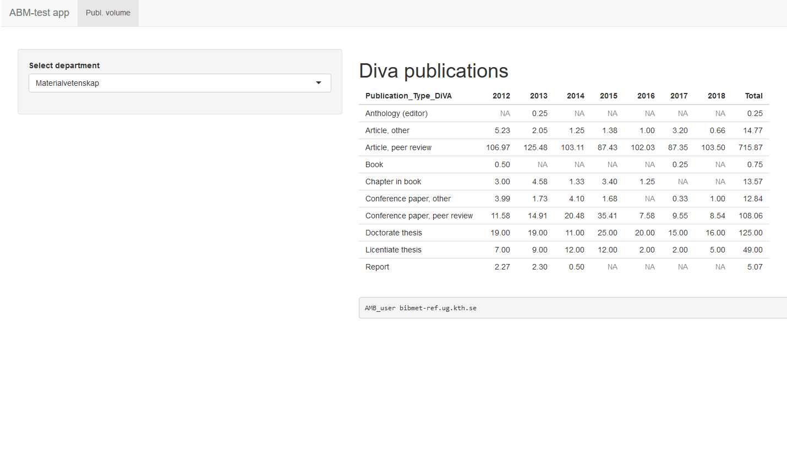
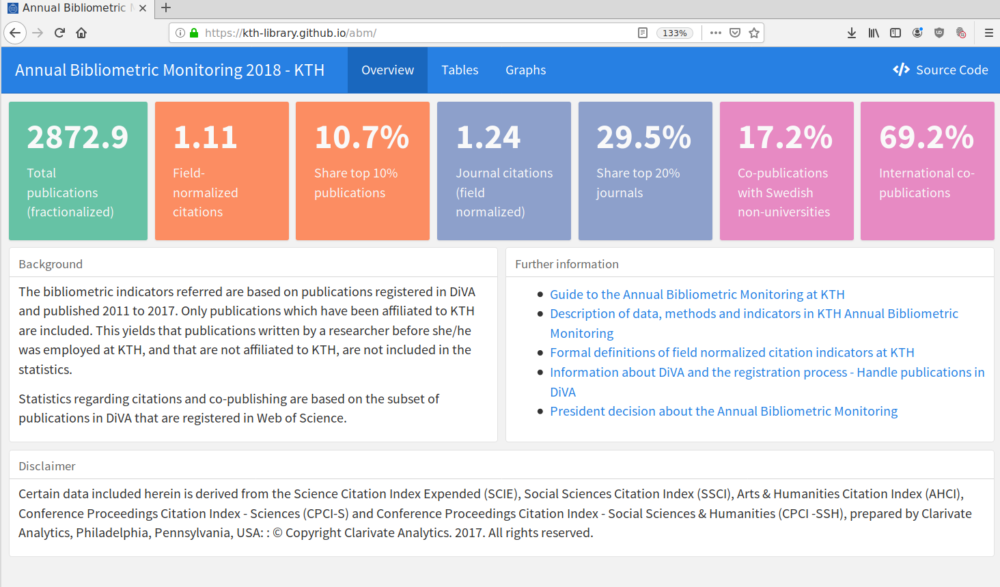
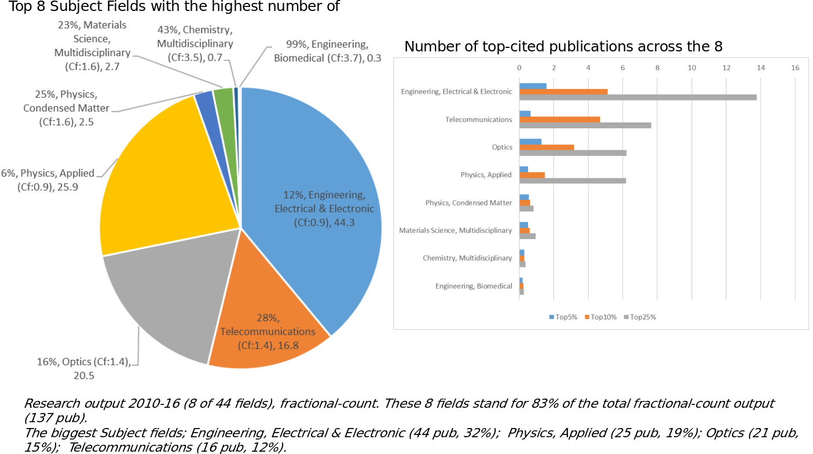
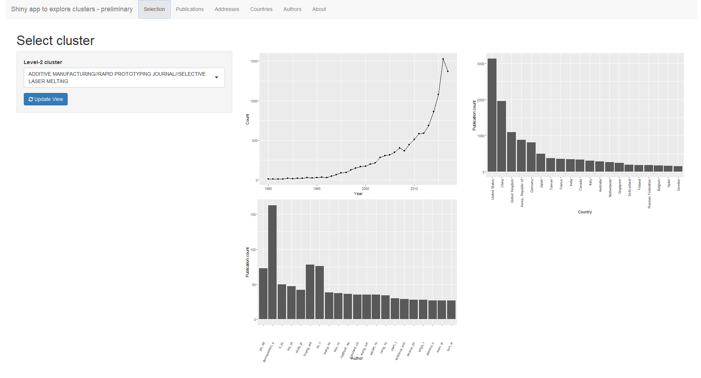
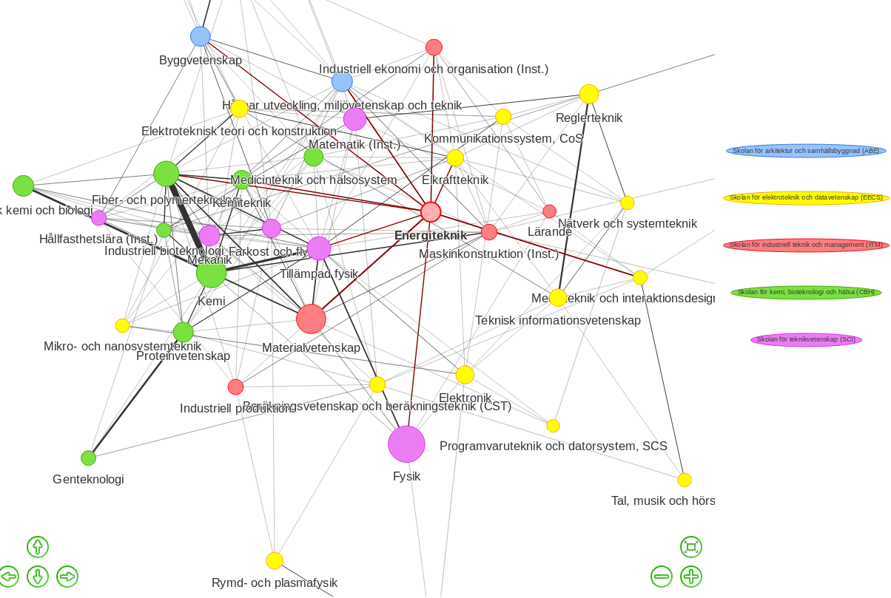
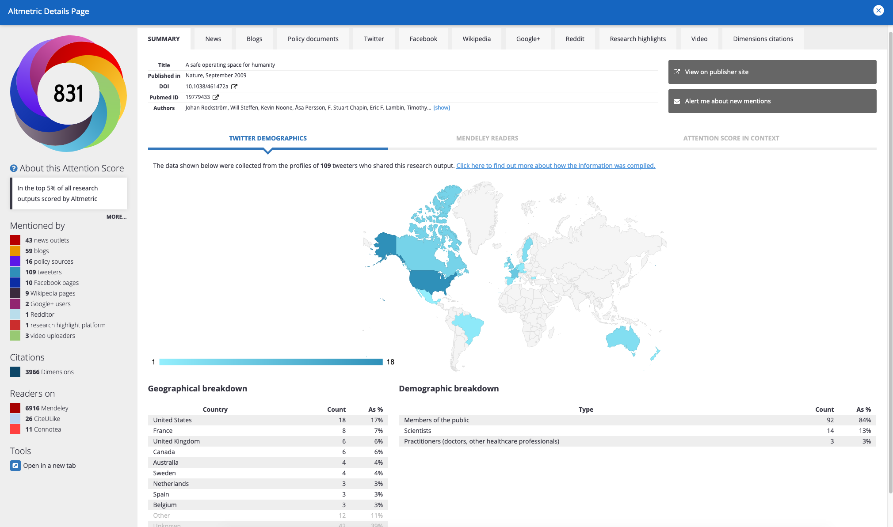
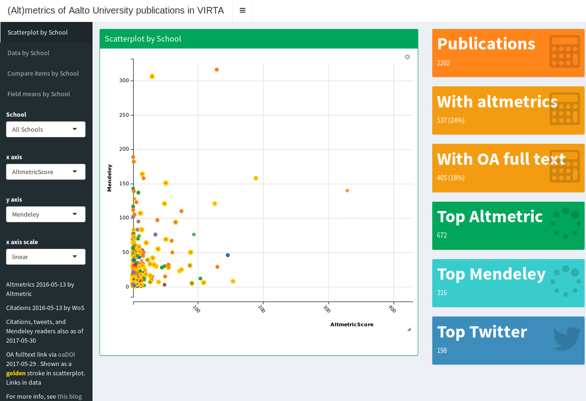

```{r setup, include=FALSE}
knitr::opts_chunk$set(echo = FALSE)
knitr::opts_chunk$set(cache = TRUE)
library(webshot)
#webshot::install_phantomjs()
#unlink("retrosearch-screenshot.png")

suppressPackageStartupMessages(library(magick))

```

## Demo ÅBU 1.0

[{height=450px}](https://shiny-1-r.referens.sys.kth.se/git/diva_summary/)

## Demo ÅBU 1.0

[{height=450px}](https://KTH-Library.github.io/abm/)

## WoS subject category profile, fractional count

{height=450px}

## Topic clustering

{height=450px}

## Map of all Swedish publications since ~ 1975 (WoS)

```{r}
library(leaflet)

markers <- read.csv('geodata.csv')

m <-
  leaflet(data = markers) %>%
  addTiles(
    urlTemplate = "//{s}.basemaps.cartocdn.com/light_all/{z}/{x}/{y}{r}.png", 
    options = tileOptions(maxZoom = 18), group = "Gray", layerId = "test"
  )

getMyIcon <- function(npubs){
    if (npubs < 100) {markColor <- 'lightgreen'}
    else if (npubs < 1000) {markColor <- 'green'}
    else if (npubs < 50000) {markColor <- 'orange'}
    else {markColor <- 'red'}
    return(awesomeIcons(icon = 'book', iconColor = 'black', library = 'glyphicon', markerColor = markColor))
}

for (j in 1:length(markers$name)) {
    m <- addAwesomeMarkers(m, lng=as.numeric(markers$longitude[j]), lat=as.numeric(markers$latitude[j]), popup=paste(markers$artiklar[j],"publications <br> in",markers$name[j]), icon=getMyIcon(markers$artiklar[j]), options = markerOptions(npubs=markers$artiklar[j]), clusterOptions = markerClusterOptions(maxClusterRadius=120, iconCreateFunction=JS("function (cluster) {
    var markers = cluster.getAllChildMarkers();
    var count = 0;
    for( var i = 0; i<markers.length; i++ ) {
      count = count + markers[i].options.npubs;
    }
    var c = ' marker-cluster-';
    if (count < 1000) {  
      c += 'small';  
    } else if (count < 50000) {  
      c += 'medium';  
    } else { 
      c += 'large';
    }
    return new L.DivIcon({ html: '<div><span>' + count + '</span></div>', className: 'marker-cluster' + c, iconSize: new L.Point(40, 40) });

  }")), clusterId = "cluster1")
}

m

```

## Co-publication network between KTH departments {.smaller}

[{height=450px}](https://shiny-1-r.referens.sys.kth.se/git/copub_dept)

[Källkod på GitHub](https://gita.sys.kth.se/kthb/bibliometric-monitoring/tree/master/apps/copub_dept)

## Potential future data sources and indicators

- h-index
- Scopus
- Journal rankings from Norwegian list
- Conference rankings
- Open Access indicators

# Future possibilities


## Adding value for researchers

- How do you think Bibliometric reporting can be improved for individual researchers at KTH?

## Ideas and possibilities:

- Different indicators at different levels of aggregation.

- Support exploration of bibliometric data related to specific publications and researchers.

- Add more "altmetrics" for individual researchers for a broader view of their impact.

- Add more data related to Open Access publications. 

## Adding value in KTH management staff

- How do you think Bibliometric reporting can be improved for management?

## Ideas and possibilities:

- Make reporting on ranking for KTH and comparisons within Sweden and perhaps Europe available
- Make reporting on Open Access publications and associated fees from Directory of Open Access Journals (DOAJ) available
- Reporting on international research collaborations and funding organizations

# Examples

A couple of visual examples follow, involving use of open source based tools and visualizations that are web-friendly and responsive and interactive.

## Altmetrics

[{height=450px}](https://www.altmetric.com/explorer/outputs?show_details=208908)


## OA Publication Costs for KTH

```{r}
knitr::include_url("https://treemaps.intact-project.org/apcdata/kth/embed/reduced")
```


## OA Publications Costs (€) from OpenAPC {.smaller}

```{css}
.rpivotTable
    {
    overflow-x: auto;
    overflow-y: auto;
    }
```

```{r, message=FALSE, out.width="100%", out.height="90%"}

library(rpivotTable)
library(readr)
library(dplyr)

apc_se_rich <- paste0(
    "https://raw.githubusercontent.com/OpenAPC/openapc-de/master/data/openapc-se/",
    "apc_se_enriched.csv"
  )

df <- 
  apc_se_rich %>%
  read_csv() %>%
  filter(!is.na(doi))

df2 <- 
  df %>% 
  select(
    Institution = "institution",
    Period = "period", 
    Euro = "euro",
    Publisher = "publisher",
    Journal = "journal_full_title",
    DOAJ = "doaj"
  )


rpivotTable(
  data = df2, width="100%", height="450px",
  cols = c("Institution", "Period", "DOAJ"),
  rows = c("Publisher"),
  vals = "Euro",
  aggregatorName = "Sum",
  rendererName = "Heatmap",
  inclusions = list(Institution = list(
    "KTH Royal Institute of Technology" #, 
    #"Chalmers University of Technology"
  ))
)


```

Source: https://treemaps.intact-project.org/ and https://github.com/OpenAPC/openapc-de

## Finnish ÅBU example

Who is Tuija Sonkkila, from Finland? 

She is working at Aalto University Leadership Support Services. Altmetrics, SQL, Power BI, QlikView, data wrangling. She has written a paper on [Metrics, Altmetrics, Data Visualization](https://docs.lib.purdue.edu/cgi/viewcontent.cgi?article=2046&context=iatul)

She has developed **Shiny apps** covering bibliometrics analytics for Aalto University. Find more about her work at [Tuijas web page](https://blogs.aalto.fi/suoritin/) and at [her private blog at](https://tuijasonkkila.fi/blog).

She also produces analytics and reporting on other things like **staff mobility**: https://github.com/tts/mobility2018


## Finnish ÅBU example {.smaller}

[{height=450px}](https://ttso.shinyapps.io/aaltovirta/)

## Other examples of Tuija's public work

Here are some links to her open source work, based on R, often using Shiny:

- https://github.com/tts/aaltoaltmetrics
- https://blogs.aalto.fi/suoritin/2015/07/02/looking-at-keywords-in-ref2014-impact-case-studies/
- https://github.com/tts/aaltoced4pureconf
- https://github.com/tts/opencitations/blob/master/query.R
- https://github.com/tts/aaltovirta
- https://github.com/tts/altm2016top100
- https://github.com/tts/aaltoaltmetrics
