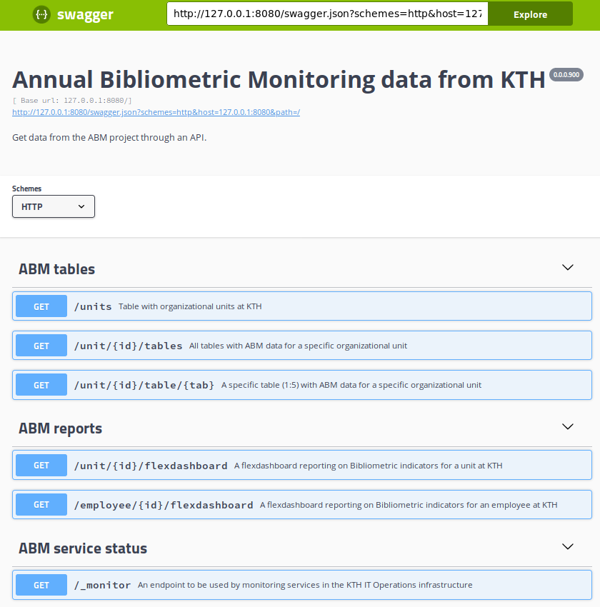
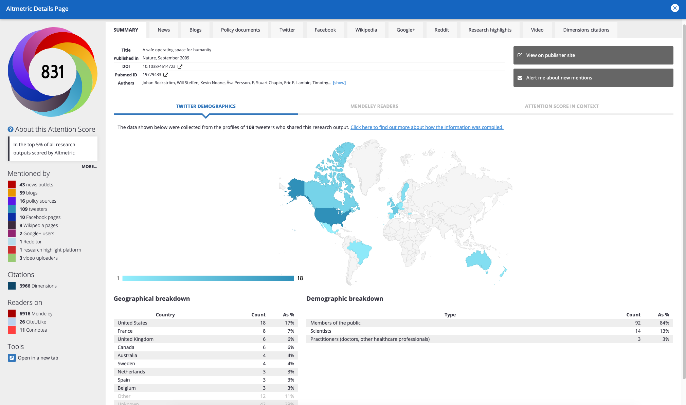
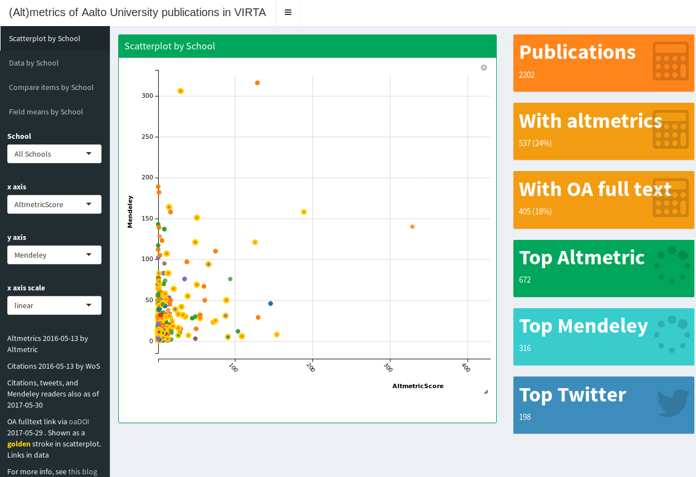

```{r setup, include=FALSE}
knitr::opts_chunk$set(echo = FALSE)
knitr::opts_chunk$set(cache = TRUE)
library(webshot)
#webshot::install_phantomjs()
#unlink("retrosearch-screenshot.png")

suppressPackageStartupMessages(library(magick))
```


## Background

**Goal:** Replacing the previous ABM (Annual Bibliometric Monitoring / Årlig Bibliometrisk Uppföljning).

- Project description

- Overview of old ÅBU

- Example apps and showing data flows

- Demo of possible additions

- Q/A and suggestions

## Agenda

- **Feedback** to suggestions and comments

- Progress so far

- **Demo** of new ABM app  
  $\rightarrow$ progress towards ÅBU 1.0

- Future **possibilities** / examples

- Discussion

## From previous demo

- Questions on the bibliometric evaluation model was raised.  
  $\rightarrow$ **organization based**  
  Evaluation of KTH-output and higher precision. Will add further **FAQ** to the ABM to answer common concerns and questions.
  
- Incorrect mappings and wrongly assigned publications  
  $\rightarrow$ **based on school dialog** and checks by researchers
  
- Clearer view of incentives and how publications contribute to impact  
  $\rightarrow$ will add **sortable list** of top-contributing papers and journals


## From previous demo, cont'd

- **Data access** and exports were requested.  
  $\rightarrow$ We are developing **an API** (currenlty JSON data) and an R package which bundles "public" data (without requiring database credentials).

- **Data sources** were discussed, including possible additions  
  $\rightarrow$ We are testing Scopus data, to add this as complementary indicators (citation counts, Scopus coverage)  
  $\rightarrow$ We also intend to add functionality to the R package, to embed access to relevant **open data sources** (e.g. Microsoft Academic, Altmetric, Google Scholar etc).
  
## From previous demo, cont'd

Some comments on KTH's goals and incentives with bibliometrics.

> This should be an ongoing discussion within KTH leadership and the schools, with input from bibliometric group.

## Demo of ÅBU 1.0

- We will show some of the work from the last month
- Sprint 7 - added data, dashboards, API etc
- We are getting ready to roll out work into production

## ÅBU 1.0 products

- [Workflows](https://kth-library.github.io/workflow/#6)
- [Components are part of a platform](https://kth-library.github.io/workflow/#2)
- You can use the R package "bibliomatrix" [open source, on GitHub](https://github.com/kth-library/bibliomatrix)
  - [documentation is available here](https://kth-library.github.io/bibliomatrix)
  - you can use embedded public data without requiring database credentials
  - data will be updated with official ÅBU results
- New reports/dashboards and a shiny app
- New API providing data access


# Live demo

Demo of Dashboard / Shiny App / API

## 

<iframe width="560" height="315" src="abm.webm" frameborder="0" allowfullscreen></iframe>

## 

<iframe width="560" height="315" src="abm.html" frameborder="0" allowfullscreen></iframe>

## {.smaller}

{height=500px}


# Feedback

- What are your impressions?

- Do you think this can replace the existing older ÅBU reporting?

- Anything you'd like to change or add in the future?

# Future possibilities

A couple of visual examples follow, involving use of open source based tools and visualizations that are web-friendly and responsive and interactive.

## Altmetrics

[{height=450px}](https://www.altmetric.com/explorer/outputs?show_details=208908)


## OA Publication Costs for KTH

```{r}
knitr::include_url("https://treemaps.intact-project.org/apcdata/kth/embed/reduced")
```

# Open data sources and international comparisons

- Open Access Article Processing Charges
- What are University Management looking at in Finland?

## Open APC Costs (€) {.smaller}

```{css}
.rpivotTable
    {
    overflow-x: auto;
    overflow-y: auto;
    }
```

```{r, message=FALSE, out.width="100%", out.height="90%"}

library(rpivotTable)
library(readr)
library(dplyr)

apc_se_rich <- paste0(
    "https://raw.githubusercontent.com/OpenAPC/openapc-de/master/data/openapc-se/",
    "apc_se_enriched.csv"
  )

df <- 
  apc_se_rich %>%
  read_csv() %>%
  filter(!is.na(doi))

df2 <- 
  df %>% 
  select(
    Institution = "institution",
    Period = "period", 
    Euro = "euro",
    Publisher = "publisher",
    Journal = "journal_full_title",
    DOAJ = "doaj"
  )


rpivotTable(
  data = df2, width="100%", height="450px",
  cols = c("Institution", "Period", "DOAJ"),
  rows = c("Publisher"),
  vals = "Euro",
  aggregatorName = "Sum",
  rendererName = "Heatmap",
  inclusions = list(Institution = list(
    "KTH Royal Institute of Technology" #, 
    #"Chalmers University of Technology"
  ))
)


```

https://treemaps.intact-project.org/ & https://github.com/OpenAPC/openapc-de

## Finnish ÅBU example

Who is Tuija Sonkkila, from Finland? 

She is working at Aalto University Leadership Support Services. Altmetrics, SQL, Power BI, QlikView, data wrangling. She has written a paper on [Metrics, Altmetrics, Data Visualization](https://docs.lib.purdue.edu/cgi/viewcontent.cgi?article=2046&context=iatul)

She has developed **Shiny apps** covering bibliometrics analytics for Aalto University. Find more about her work at [Tuijas web page](https://blogs.aalto.fi/suoritin/) and at [her private blog at](https://tuijasonkkila.fi/blog).

She also produces analytics and reporting on other things like **staff mobility**: https://github.com/tts/mobility2018


## Finnish ÅBU example {.smaller}

[{height=450px}](https://ttso.shinyapps.io/aaltovirta/)

## Other examples of Tuija's public work

Here are some links to her open source work, based on R, often using Shiny:

- https://github.com/tts/aaltoaltmetrics
- https://blogs.aalto.fi/suoritin/2015/07/02/looking-at-keywords-in-ref2014-impact-case-studies/
- https://github.com/tts/aaltoced4pureconf
- https://github.com/tts/opencitations/blob/master/query.R
- https://github.com/tts/aaltovirta
- https://github.com/tts/altm2016top100
- https://github.com/tts/aaltoaltmetrics
