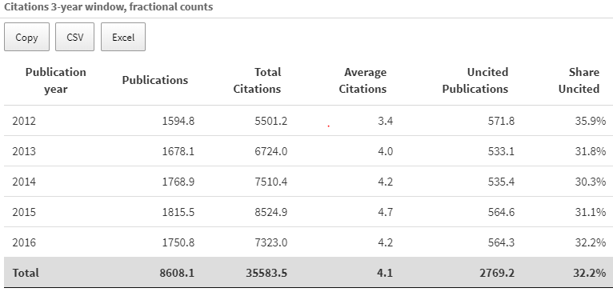

  
```{r setup, include=FALSE}
knitr::opts_chunk$set(echo = FALSE)

library(ktheme)
library(webshot)

red <- function(txt) 
  sprintf("<font color='%s'>\n%s\n</font>", tolower(palette_kth()["cerise"]), txt)

#webshot::install_phantomjs()
#unlink("retrosearch-screenshot.png")

suppressPackageStartupMessages(library(magick))

# BG images that could be used

```

## Background {data-background=assets/bg/kth-6.png data-background-size=cover}

**Goal:** 

> Replace the previous ABM ie Annual Bibliometric Monitoring / Årlig Bibliometrisk Uppföljning at KTH

Our [previous demo meeting](https://KTH-Library.github.io/demo-2) was held 2019-12-05.

Since then (> __3 months ago__) we have worked on Sprints **8 to 11** (current)

## Agenda 

The [1.0 release is done](https://kth.se/abm), three releases have been published so far

- Progress - What is **new** since last meeting?

- A short **demo** of the ABM app

- Future **directions** after 1.0 release

- Our **questions** to you

- Your **feedback** and your suggestions and comments to us

## Activities {data-background=assets/bg/kth-5.png data-background-size=cover}

- Christmas - we made a [**checklist** for production release](checklist.png) - all items are checked
- Production **roll-out** with a couple of releases ([changelog](https://kth-library.github.io/bibliomatrix/news/index.html))
- Learning together in **workshops**
- Other (non-ABM-app) **tools** provided

## Progress towards ABM 1.0


- Tab with Open Acess data
- SAML-integration (SSO)
- Public/private modes implemented in the ABM app
- Combo of shinyproxy for authed SAML and Shiny Server CE for non-authed public app
- Stress testing and browser testing (50 simultaneous users)
- Responsive mobile layout
- Proxy chain integration 
- Caching content
- Bug fixing
- [Documentation updates](https://KTH-Library.github.io)

## Stats @ Git Hub ... {data-background=assets/bg/kth-10.png data-background-size=cover}

- GitHub: 42 closed pull request, > 400 commits, 7 repos, 10 open issues and 50 closed
- DockerHub shows 10K+ downloads for [KONTARION](https://hub.docker.com/r/kthb/kontarion)

## Workshops/learning {data-background=assets/bg/kth-11.png data-background-size=cover}

- [Agile workflow workshop](https://KTH-Library.github.io/workflow) 
- [Operations/maintenance workshop](https://KTH-Library.github.io/operations) 
- [Performance improvements workshop](https://KTH-Library.github.io/performance)
- [Web APIs usage workshop](https://KTH-Library.github.io/webapis)
- [Open Data Science Platforms - Trends from FOSDEM20 in Bruxelles](https://KTH-Library.github.io/open-datascience-platforms)

## Other new tools 

- Access through API wrappers to new data sources
  - Use case described by Chip related to DiVA data quality improvements -> new R packages with API Wrapper clients
    - [`kthapi`](https://github.com/KTH-Library/kthapi) for accessing data from KTH APIs
    - [`dblp`](https://github.com/KTH-Library/dblp) for accessing data from API at https://dblp.org (CS biliographics)
    - [`XsearchLIBRIS`](https://github.com/KTH-Library/XsearchLIBRIS) for searches against LIBRIS and SwePub
  - Co-publication

- KTH Styling for R users: [`ktheme`](https://github.com/KTH-Library/ktheme) ... used for example to make these slides

# Live demo - ABM dashboard

Demo of Dashboard / Shiny App / API

## 

<iframe width="560" height="315" src="abm.webm" frameborder="0" allowfullscreen></iframe>

## Open Access data in ABM {data-background=assets/bg/kth-4.png data-background-size=cover}

TODO - Gaël

## Uncited publications

- In addition to the total and average number of citations, the number and share of uncited publications are included
- Uncited here means not cited after 3 years (the publication year and the two following years)
- The other end of "Top 10% cited"

{height=300 .hcenter}

## "About" tab and other information

Currently:

- brief information in the **Overview** tab
- longer texts in **Guide to ABM** and other documents linked from **Overview**
- technical documentation at [github.io](https://KTH-Library.github.io)

More information needed, such as:

- Where do these data come from and when what is retrieved?
- What criteria were used to select which publications to include?
- Outside of the ABM, how is bibliometrics used at KTH?

Much of the information directly related to the ABM can be put in an **About** tab.

## Questions from us to you

- Does the in-dashboard notes to assist in **interpreting indicators** in the case of low `n` help?
- Do you think the **PDF Guide** works? Is it useful?
- What information would you like to see in an **About tab**?
- What do you think is **missing** in the ABM dashboard?

- Should non-KTH publications be included?

# Thanks for your attention! If time permits...

## Technical solution in ÅBU {data-background=assets/bg/kth-5.png data-background-size=cover}

Open source-based platform for reproducible research including web-friendly data analysis:
  
- Front-end for open data science [KONTARION](https://github.com/kth-library/kontarion)

- Can do __ML och AI__, scales locally or in the cloud using Docker Swarm / Kubernetes, container-based, supports ML/AI workflows using R, Python (Jupyter) etc... GPU-scaling and [slurm jobs](https://docs.rstudio.com/rsp/integration/launcher-slurm/))

- Add-on: Backend for big data using [Apache Spark + Minio + Select S3](https://docs.google.com/presentation/d/1eGahU6aR9GynYYyka2X-tTLSqLISEGvz7ZzfgfYq6Qw/edit#slide=id.g54b55e0426_0_0)

[](https://github.com/kth-library/kontarion)
                                                                        
## Hybrid cloud big/fast data backend {data-background=assets/bg/kth-5.png data-background-size=cover}

Data Lake w/ Minio + Apache Spark + S3 Select + RStudio Web Edition / JupyterHub

{height=450}

[Minio blog article about S3 Select](https://blog.minio.io/running-peta-scale-spark-jobs-on-object-storage-using-s3-select-df7177ae518)

## Handbook {data-background=assets/bg/kth-5.png data-background-size=cover}

{height=450}

https://therinspark.com/
