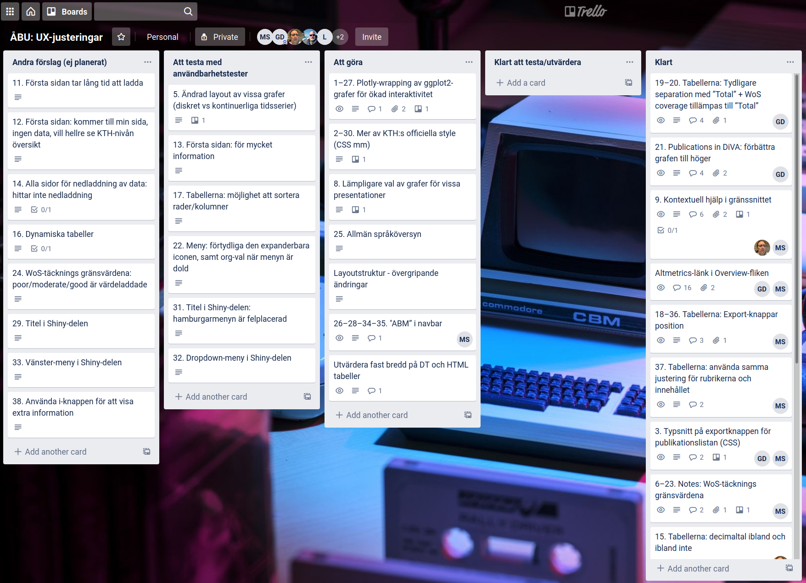
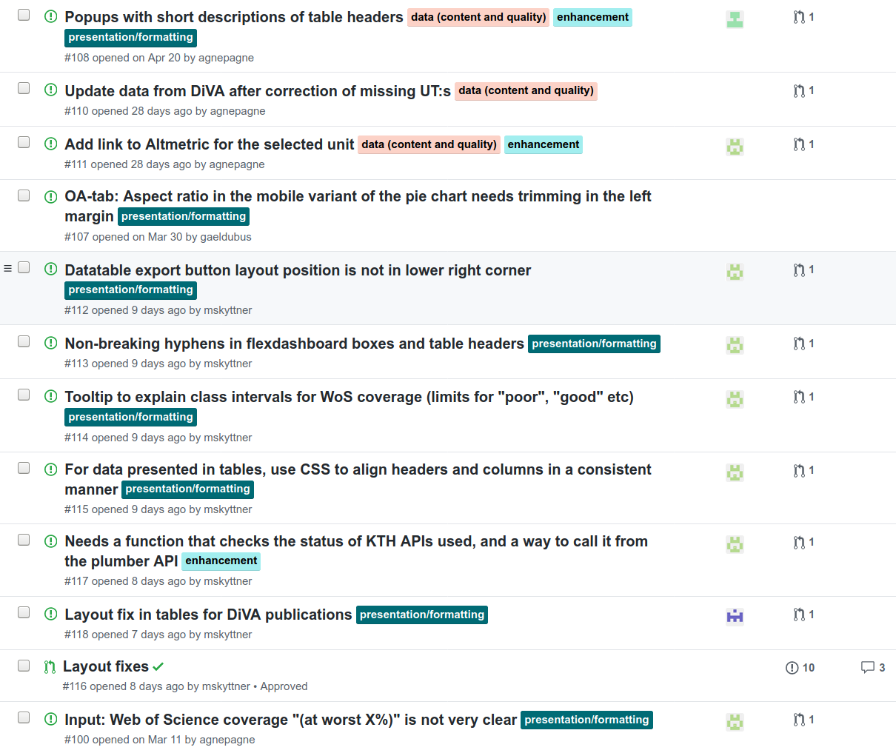

  
```{r setup, include=FALSE}
knitr::opts_chunk$set(echo = FALSE)

library(ktheme)
library(webshot)

red <- function(txt) 
  sprintf("<font color='%s'>\n%s\n</font>", tolower(palette_kth()["cerise"]), txt)

#webshot::install_phantomjs()
#unlink("retrosearch-screenshot.png")

suppressPackageStartupMessages(library(magick))

# BG images that could be used

```

## Background 

**Goal:** 

> Replace the previous ABM ie Annual Bibliometric Monitoring / Årlig Bibliometrisk Uppföljning at KTH

**Summary:**

Our [previous demo meeting](https://KTH-Library.github.io/demo-3) was held 2020-03-24. Since then we have worked (remotely) on Sprints **12 to 16** (current).

The [ABM services at KTH](https://kth.se/abm) are operational and the "old" ABM has been taken off-line. The team has now made a **service update (data and UX improvements)** and is building capacity for the operational / maintenance phase.

## Agenda {data-background=assets/bg/kth-6.png data-background-size=cover}

- Progress - What is **new** since last meeting?

- A short **demo** of the ABM app

- Our **questions** to you

- Your **feedback** and your suggestions and comments to us

- Future **directions**

## What is new? {data-background=assets/bg/plant.png data-background-size=cover}

- The "old" ABM / ÅBU has been sunsetted / retired and [outreach communications was made about the new "ABM"](https://intra.kth.se/aktuellt/nyheter/kth-s-publiceringar-i-fokus-1.980728) on the KTH Intranet

- We have spent time on capacity building for operations phase (KTHB + ITA)

- `r red("Updated data")` and data quality improvements (-> better WoS coverage for KTH) and preparations for using Scopus data

- We have also worked on integrating `r red("data from KTH APIs")` and style elements from KTHs graphical style

- The main focus has been on `r red("UX / UI / Layout fixes")` in the user interface, based on feedback from Demo-3 with a complete [list of changes here](https://github.com/KTH-Library/bibliomatrix/milestone/4)

## New components integrated in ABM

NB: These new R packages (`kthapi` and `ktheme`) can be used for data integrations and KTH styling also in a wider context (not ABM-specific) by researchers at KTH.

### Data integrations

- Development and integration of [`kthapi` R package](https://github.com/KTH-Library/kthapi) and integration of data (for example mapping DiVA -> KTH Directory/Profile APIs -> Altmetric data)

### KTH styling

- Development and integration of [`ktheme` R package](https://github.com/KTH-Library/ktheme) for thematic styling of visuals using KTH style

# UX improvements

##

A Trello board was used to capture feedback from the Demo-3-meeting in the area of UX improvements


{width=500}


## 

A set of layout fixes were implemented and rolled out to the [reference environment](https://shiny-2-r.referens.sys.kth.se/public)

{width=300}

# Live demo

Demo of Dashboard / Shiny App

## 

<iframe width="560" height="315" src="ABM_KTH_Demo_2020-05-26.mp4" frameborder="0" allowfullscreen></iframe>

# Questions and feedback

## Recap - Feedback from the Demo-3 meeting

At the Demo-3 meeting we suggested that we would work on adding an about tab, more comprehensive co-publication information and ways for researchers to discover collaboration networks.

The feedback from Demo-3 instead suggested we should work on `r red("UX and data improvements")` and look into how to add Scopus as a data source. 

## Questions to the Demo-4 group

- Does the in-dashboard notes simplify **interpreting indicators**? Context help as tooltips, understanding of intervals for "Good / Moderate / Poor" etc.
- Next phase for UX work - should we add more interactivity to the dashboard sections (plots etc)?

# What is planned next?

## Next phase for ABM

Going forward, we suggest that we focus on these areas of improvements:

- Extending the ABM services with more functionality, such as more comprehensive co-publication information
- Continue with more work to improve UX
- Add an app for exploring research collaboration networks
- Continue work on integration approach for Scopus data source
- Continue work aiming at allowing managers to [view data at division level](https://kth-library.github.io/kthapi/articles/Potential-Heads.html#division-level-data)

Please think about what would be **most useful to you** in the short run?
