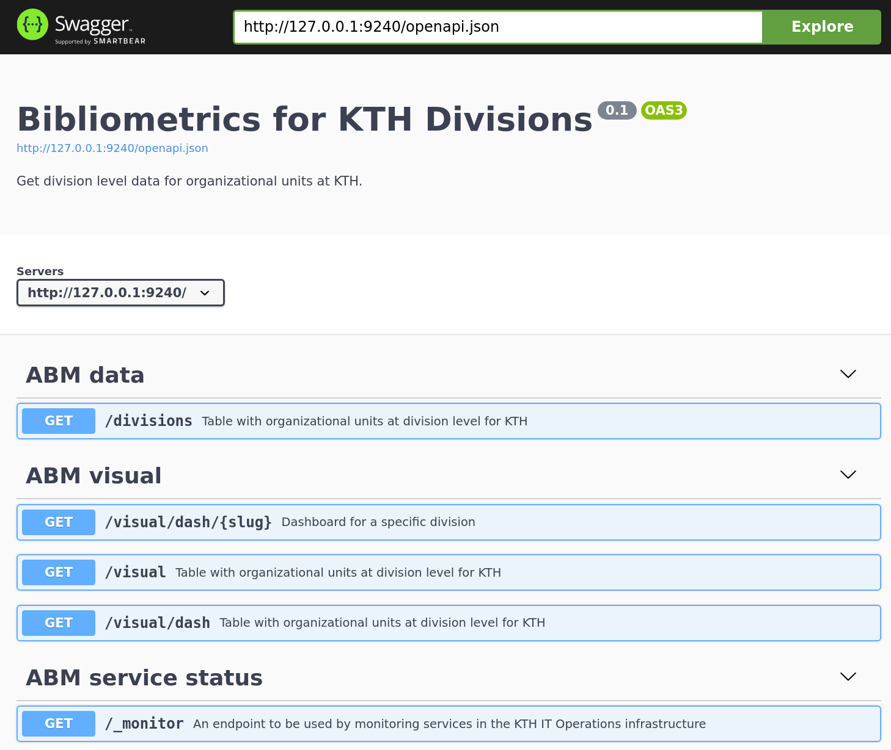

  
```{r setup, include=FALSE}
knitr::opts_chunk$set(echo = FALSE)

library(ktheme)
library(webshot)
library(DT)
library(ggplot2)
library(reshape2)
library(formattable)

red <- function(txt) 
  sprintf("<font color='%s'>\n%s\n</font>", tolower(palette_kth()["cerise"]), txt)

#webshot::install_phantomjs()
#unlink("retrosearch-screenshot.png")

suppressPackageStartupMessages(library(magick))

# BG images that could be used

```

## Background 

**Goal:** 

> Replace the previous ABM i.e. Annual Bibliometric Monitoring / Årlig Bibliometrisk Uppföljning at KTH

**Summary:**

Our [previous demo meeting](https://KTH-Library.github.io/demo-4) was held 2020-05-26. After summer vacations we have worked on Sprints **17 to 23** (current).

The [ABM services at KTH](https://kth.se/abm) have been operational since the last demo meeting, with some maintenance and updates during autumn, for example involving server upgrades and rotation of certificates.

## Agenda {data-background=assets/bg/kth-6.png data-background-size=cover}

- Progress - What is **new** since last meeting?

- A short **demo** of the current work

- Update about **Scopus data integration**

- Update about **other efforts** (other data integration, APIs etc)

- Your **questions and feedback**, suggestions for future directions

## What is new? {data-background=assets/bg/plant.png data-background-size=cover}

- During the autumn, we have primarily focused on a `r red("proof of concept for author based")` reporting showing results at divisional level, based on currently employed researcher and their publication outputs.

- Data integration work has been initiated with regards to using `r red("Scopus data")` from Elsevier in order to complement the WoS data.

## Demo

  - Introduction to [**current ABM**](https://abm.sys.kth.se/public/) for new attendees
  - Background for new **author based POC** (Proof Of Concept) 
  - Demonstration of author based reporting for KTH divisions
    - Examples
      - A few **divisions** (sv. avdelningar)
      - A few **departments** (sv. institutioner) versus current ABM
    - Some observations and explanations of differences

## Author based selection of publications

- Organization based = **organizational affiliation** when publication was written
  - Usually used for reporting etc
  - Publications directly tied to organizational unit
- Author based = publications made by **currently employed researchers** at the unit
  - Usually used for prospective analysis, current "brain power"
- Aim in this case is still reporting for **KTH publications**
  - Fetch employees from **HR system / KTH APIs** and collect their publications
  - Can be strongly influenced by staff turnover, and interact with staff groups

## Author-based: Divisions

  - [Overview for KTH Divisions](abm_divisions.html)
  
  - Examples
    - DIVISION OF ELECTRIC POWER AND ENERGY SYSTEMS: ["j/jj/jjn"](j_jj_jjn.html)
    - DIVISION OF COMPUTATIONAL SCIENCE AND TECHNOLOGY: ["j/jh/jhs"](j_jh_jhs.html)
    - DIVISION OF SPACE AND PLASMA PHYSICS: ["j/jj/jje"](j_jj_jje.html)
    - NUCLEAR ENGINEERING: ["s/sh/shh"](s_sh_shh.html)
    - MATERIALS AND NANOPHYSICS: ["s/sk/skq"](s_sk_skq.html)
    
## Author-based: Departments

  - Examples - these can be compared against [current ABM](https://abm.sys.kth.se/public/)
    - Electrical engineering: ["j/jj"](j_jj.html)
    - Computer Science: ["j/jh"](j_jh.html)
    - Applied Physics: ["s/sk"](s_sk.html)
    
## Author-based: Department summary

```{r, echo=FALSE, warning=FALSE, message=FALSE}
dept_summary<- read.csv2(file="compare.csv", header=TRUE)
colnames(dept_summary)<- c("Department","Publ, frac", "cf 2015-2017", "Top10%", "jcf 2016-2018", "Int. co-pub", "Type")
datatable(dept_summary, rownames=FALSE, options = list(dom = 't')) %>%
  formatStyle(columns = colnames(.$x$data), `font-size` = "70%") %>%
  formatStyle('Type', target = 'row', Color = styleEqual(c('org', 'staff'), c(palette_kth()["blue"], palette_kth()["cerise"])))
```

## Scopus data integration

- **Web of Science** data (Clarivate) used for ABM/ÅBU

- **Scopus** data (Elsevier) has been acquired
  - Better coverage of conference proceedings
  - Comparison of coverage Scopus vs WoS (2012--2019); [download here](Coverage.xlsx)
  - Plans to integrate in existing ABM app as complement to WoS

## Scopus coverage gain: publication types {.smaller}

```{r, echo=FALSE, warning=FALSE, message=FALSE}
library(readxl)
library(dplyr)
library(formattable)


versus <- bind_rows(
  read_xlsx("Coverage.xlsx") %>%
    mutate(peerreviewed = TRUE),
  read_xlsx("Coverage.xlsx", sheet = 2) %>%
    mutate(peerreviewed = FALSE)
)

d1 <- 
  versus %>% select(-c("Department id")) %>% 
  mutate_at(5:8, function(x) round(x, 1))
  
d2 <- d1 %>%
  filter(peerreviewed == TRUE, `WoS coverage (%)` > 0) %>%
  select(-c("peerreviewed"))
  
d3 <- d1 %>%
  filter(peerreviewed == FALSE, `WoS coverage (%)` > 0) %>%
  select(-c("peerreviewed"))

color_tile_divergent <- function(x) ifelse(x <= 0, 
  color_tile("lightpink", "transparent")(x * c(x <= 0)),
  color_tile("transparent", "lightblue")(x * c(x > 0)))

fdt <- function(data)
  as.datatable(rownames = FALSE, class = "stripe", options = list(
    initComplete = htmlwidgets::JS("
                        function(settings, json) {
                          $(this.api().table().container()).css({
                          'font-size': '11px',
                          });
                        }
                    "),
    columnDefs = list(list(className = 'dt-left', targets = "_all")),
    pageLength = 300L, bPaginate = FALSE, scrollY = 380,
    dom = 'ftB'), x = formattable(data, list(
    `Total publications` = color_bar("lightblue"),
    `Publications in Scopus` = color_bar("lightblue"),
    `Publications in WoS` = color_bar("lightblue"),
    `Scopus coverage (%)` = color_bar("lightgray"),
    `WoS coverage (%)` = color_bar("lightgray"),
    `Scopus coverage gain (%)` = color_tile_divergent
    ))) %>% DT::formatStyle(columns = colnames(.$x$data), `font-size` = "11px")

dt1 <- fdt(d2)
dt2 <- fdt(d3)

pr <- versus %>% filter(peerreviewed == TRUE)
kthres <- pr %>% filter(`Department name`=="KTH Royal Institute of Technology")
allpubres <- pr %>% filter(`Publication type`=="All types")
Data1 <- kthres %>% filter(!`Publication type` %in% c("All types","Artikel i tidskrift","Artikel, forskningsöversikt","Artikel, recension"), `Publications in Scopus` > 0)
Data1disp <- Data1 %>% mutate(`Publication type` = case_when(
         `Publication type`=="Kapitel i bok, del av antologi" ~ "Book chapters",
         `Publication type`=="Bok" ~ "Books",
         `Publication type`=="Konferensbidrag" ~ "Conference proceedings\n",
         `Publication type`=="All journal articles" ~ "Journal articles\n",
         `Publication type`=="Samlingsverk (redaktörskap)" ~ "Collections (editor)\n",
         `Publication type`=="Proceedings (redaktörskap)" ~ "Conf. proceedings\n(editor)",
         TRUE ~ `Publication type`))
Data1b <- kthres %>% filter(`Publication type`=="All types")
Data4 <- kthres %>% filter(!`Publication type` %in% c("Artikel i tidskrift","Artikel, forskningsöversikt","Artikel, recension"), `Publications in Scopus` > 0) %>% mutate(`Publication type` = case_when(
         `Publication type`=="Kapitel i bok, del av antologi" ~ "Book chapter\n",
         `Publication type`=="Bok" ~ "Book",
         `Publication type`=="Konferensbidrag" ~ "Conference paper\n",
         `Publication type`=="All journal articles" ~ "Journal article\n",
         `Publication type`=="Samlingsverk (redaktörskap)" ~ "Collection (editor)\n",
         `Publication type`=="Proceedings (redaktörskap)" ~ "Conf. proceedings\n(editor)",
         TRUE ~ `Publication type`)) %>% select(c("Publication type","Total publications","WoS coverage (%)","Scopus coverage (%)")) %>% melt(id.vars = c("Publication type", "Total publications"), value.name = "Coverage (%)") %>% mutate(`variable`=case_when(`variable`=="WoS coverage (%)" ~ "WoS", TRUE ~ "Scopus"))

Data2 <- allpubres %>% filter(!`Department id` %in% c("KTH","All"))
Data2b <- allpubres %>% filter(`Department id`=="KTH")
Data3 <- pr %>% filter(`Department name`=="Computer Science") %>% select(-c(`Department name`,`Department id`,`peerreviewed`)) %>%
    mutate(`Publication type` = case_when(
         `Publication type`=="Kapitel i bok, del av antologi" ~ "Book chapter",
         `Publication type`=="Bok" ~ "Book",
         `Publication type`=="Konferensbidrag" ~ "Conference paper",
         `Publication type`=="Samlingsverk (redaktörskap)" ~ "Collection (editor)",
         `Publication type`=="Proceedings (redaktörskap)" ~ "Conf. proceedings (editor)",
         `Publication type`=="Artikel i tidskrift" ~ "Journal article, regular",
         `Publication type`=="Artikel, forskningsöversikt" ~ "Journal article, review/survey",
         `Publication type`=="Artikel, recension" ~ "Journal article, book review",
         `Publication type`=="Övrigt" ~ "Other",         
         TRUE ~ `Publication type`))
dt3 <- fdt(Data3)
```

- Coverage by publication type for all KTH peer-reviewed publications

```{r}
ggplot(Data4, aes(x = reorder(paste0(`Publication type`," (", `Total publications`," pub.)"),-`Total publications`), y = `Coverage (%)`, fill = factor(variable, levels=c("WoS", "Scopus")))) + geom_col(width = 0.5, position = position_dodge(width = 0.5)) + theme(axis.text.x = element_text(angle = 50, vjust = 0.95, hjust=1)) + xlab("") + scale_fill_manual(name = "", values=c("cadetblue", "coral")) + ylim(0,100) + geom_vline(xintercept=1.5,lty="longdash")
#ggplot(Data1disp, aes(x = reorder(paste0(`Publication type`," (", `Total publications`," pub.)"),-`Total publications`), y = `Scopus coverage gain (%)`)) + geom_bar(stat="identity",fill="skyblue3", col="darkblue") + theme(axis.text.x = element_text(angle = 50, vjust = 0.95, hjust=1)) + xlab("") + geom_hline(yintercept=Data1b$`Scopus coverage gain (%)`,col="forestgreen",lwd=1,lty="longdash") + geom_text(data=data.frame(x=6.5,y=Data1b$`Scopus coverage gain (%)`-3), aes(x, y), label=paste("Coverage gain for all\nKTH publications:",round(Data1b$`Scopus coverage gain (%)`,1),"%"), vjust=-1, col="forestgreen", size=3) + ylim(0,50) + expand_limits(x= c(1,7.5))
```


## Scopus coverage gain: KTH departments {.smaller}

- Distribution of KTH departments by coverage gain for peer-reviewed publications (all publication types)

    $\scriptstyle \text{coverage gain } = \text{ Scopus coverage } - \text{ WoS coverage}$
    
```{r}
hist(Data2$`Scopus coverage gain (%)`, main = "", xlab="Scopus coverage gain (%) for peer-reviewed publications", ylab="Number of departments", col='skyblue3', border='darkblue', ylim=c(0,10))
abline(v=Data2b$`Scopus coverage gain (%)`,col="forestgreen",lwd=3,lty="longdash")
text(Data2b$`Scopus coverage gain (%)`, 9.5, paste("Coverage gain for all\nKTH publications:",round(Data2b$`Scopus coverage gain (%)`,1),"%"), col="darkgreen", cex=0.8, pos=4)
```

## Scopus coverage gain: example

- Department of Computer Science

```{r}
dt3
```


## Other efforts

- All efforts are available at [KTH-Library@GitHub](https://github.com/kth-library)

- Further use of [`kthapi` R package](https://github.com/KTH-Library/kthapi) has been the basis for the author data in the POC

- A new R package [`semanticscholar`](https://github.com/KTH-Library/semanticscholar) allows for experimenting with data integration against this data source which provides open data for publications from many researchers at KTH.

- API for public data from ABM
  - https://bibliometrics.lib.kth.se/testapi/__swagger__/

- API for author based data (BETA)

##

<center>
{width=600}
</center>

## Operations and maintenance

- we have separated operational ABM services from other **KTHB Bibliometrics services** and have allowed external users without KTH accounts to log in via the use of https://auth0.com

- we have initiated a **migration away from Travis** - a continuous integration service provider - to using GitHub Actions.

- we have **upgraded** the software stack and server environment (and rotated certificates and API keys)

- we have continued to work with the KTH Web team on aligning with the **KTH style** for web applications

# Questions and feedback

## Questions and Answers

Please provide your input!

- Questions from the Zoom chat
- Suggestions and comments
- Future directions

Thank you for attending!
