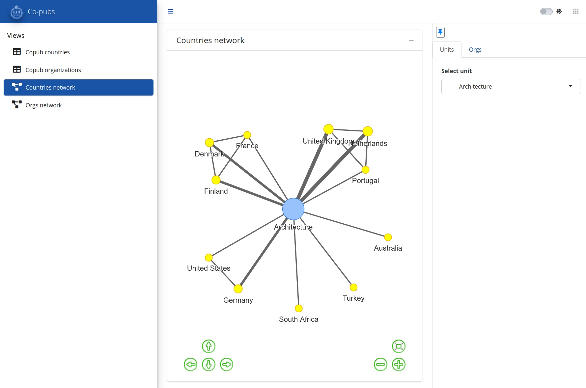

  
```{r setup, include=FALSE}
knitr::opts_chunk$set(echo = FALSE)

library(ktheme)
library(webshot)
library(DT)
library(ggplot2)
library(reshape2)
library(formattable)
library(readxl)
library(dplyr)

red <- function(txt) 
  sprintf("<font color='%s'>\n%s\n</font>", tolower(palette_kth()["cerise"]), txt)

#webshot::install_phantomjs()
#unlink("retrosearch-screenshot.png")

suppressPackageStartupMessages(library(magick))

# BG images that could be used

```

## Agenda {data-background=assets/bg/kth-6.png data-background-size=cover}

- Background

- Brief demo of current ABM

- Earlier/current ways to get co-publication data at KTH

- Your **questions and feedback**

- Proof-of-concept for co-publication app

- Wrap-up

**Netiquette:**

Please use Zoom, raise hand for questions or write in the chat, mute if not speaking, and think about questions for the Q&A session at the end.

## Background for this meeting 

**Aim**

- To show previous examples of co-publication data
- To discuss needs and use-cases that should be covered by an application

**About the project** 

In the ABM-project, we have had [previous demo meetings](https://KTH-Library.github.io/demo-6), the latest at 2021-03-25.  
The project is working by an agile model with 2 week sprints.  
From this summer the project has worked with a wider scope, to include more data sources and data flows.


## Copublications app

**Goal:** 

> 1. Present co-publication from KTH through an interactive app
> 2. Answer frequently posed questions related to networks of KTH publications
> 3. Allow the ability to view data at different organization levels and at author-name level<br/><br/><br/>...
> 4. Automate and simplify analysis


# Current ABM {.section_alt}

**ABM 2019** (2013-2019): https://abm.sys.kth.se/public/

Now with basic co-publication data added .

## Earlier examples of presentations and access

- [KTH Co-publication page](https://www.kth.se/bibliometrics/KTH/copublishing/KTH_countries_2015_2019/index.html)
- Specific requests to the bibliometric group
- Bibliometric presentations to departments
- Online publication databases(?) 

## "Standard" co-publication request

How much is KTH collaborating with organization X, and which departments and researchers are involved?  
How much is KTH collaborating with country Y?

{width=600}

{width=300}


## "Standard" co-publication request 2
:::: {style="display: flex;gap: 20px;"}
::: {}
{width=600}
:::
  
::: { style="gap: 5px;"}
Note: Including some bibliometric indicators along with publication volumes.
:::

::::


## Networks, organization-level

{width=750}

## Networks, within collaboration

{width=900}

## Networks, subject-wise / keywords

{width=900} 

# Questions 

## What are your needs?   

- Filter on other organization?
- Limit on colloboration size?
- Filter on subject category?
- Use of maps and networks?
- Need for citation and journal indicators?
- App for interal or external use (or both)?


What needs do you see for presenting **collaboration and co-publication** data?  
Suggestions and **comments**

**Questions** from the Zoom chat

# Demo of KTH co-publication app {.section_alt}

Draft co-publication app for KTH at [https://bibliometrics.lib.kth.se/apps/reports/bibliotools/kth_copub/](https://bibliometrics.lib.kth.se/apps/reports/bibliotools/kth_copub/)  

- Early proof-on-concept  
- Basic functionality, app-publishing and data flow.


## Co-publ app - screenshot


{height=500px}

# Next steps {.section_alt}

We will gather input and might contact some of you for further information

Other comments?

Thank you for attending!


