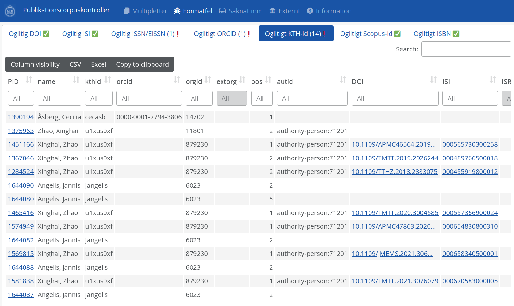

  
```{r setup, include=FALSE}
knitr::opts_chunk$set(echo = FALSE)

library(ktheme)
library(webshot)
library(DT)
library(ggplot2)
library(reshape2)
library(formattable)
library(readxl)
library(dplyr)

red <- function(txt) 
  sprintf("<font color='%s'>\n%s\n</font>", tolower(palette_kth()["cerise"]), txt)

#webshot::install_phantomjs()
#unlink("retrosearch-screenshot.png")

suppressPackageStartupMessages(library(magick))

# BG images that could be used

```

## Background for DAUF project

**Goal:** 

> 1. Show work on Bibliometric Analytics app
> 2. Show work related to data curation/quality and data integration/consolidation

**Summary:**

Our [previous demo meeting](https://KTH-Library.github.io/demo-7) was held 2021-10-12. During spring we have worked in (two-week long) Sprints **45 to 52** (current).

**Netiquette:**

Please use Zoom, raise hand for questions or write in the chat, mute if not speaking, and think about questions for the Q&A session at the end.

## Agenda {data-background=assets/bg/kth-6.png data-background-size=cover}

- Progress - and purpose - of the **DAUF** project

- Quick overview of some existing DAUF services/apps:
  * Yearly Annual Bibliometric Monitoring reporting
  * Author-based departmental reporting
  * Bibliometric Analytics app
  
- A demo presenting new work in the **"bibliometric analytics app"**

- A demo of the **data curation tool** for DiVA publication and author data

- Update about **other efforts** (data consolidation and integration etc)

- Your **questions and feedback**

## Progress - What is new during Q1 2022? {data-background=assets/bg/plant.png data-background-size=cover}

- Bibliometric Analytics app 
  * allowing exploration of co-publication and collaboration at KTH 
  * for ad-hoc research groups
  * rolling data (more up to date)

# Demo of Bibliometric Analytics app

## Bibliometric Analytics app

The goal of this app is to help answering some common questions, for example

- What does KTH collaboration with country X or university Y look like?
  * What is the bibliometric impact of this collaboration?

- What is the collaboration pattern and bibliometric impact of...
  * a KTH department, based on Diva affiliations?
  * staff currently or recently employed by some department or division?
  * some group at KTH not clearly defined in Diva or staff catalogue?
  * all the Postdocs at school Z?

# Demo of data curation tools

## Report for KTH publication corpus

[{width=800}](https://bibliometrics.lib.kth.se/qc/v1/check/report/)

## Data

- Downloads

- Curator API

- Checks API

# Questions and feedback

## Questions and Answers

Please provide your input!

- Do you think the what was presented in the demonstration meets your needs for more analytical exploration for **collaboration and co-publication** at KTH?
- **Other questions** from the Zoom chat
- Suggestions and **comments**

Thank you for attending!
