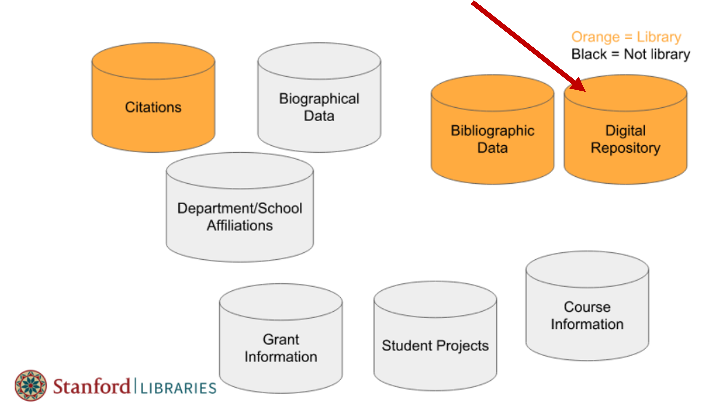
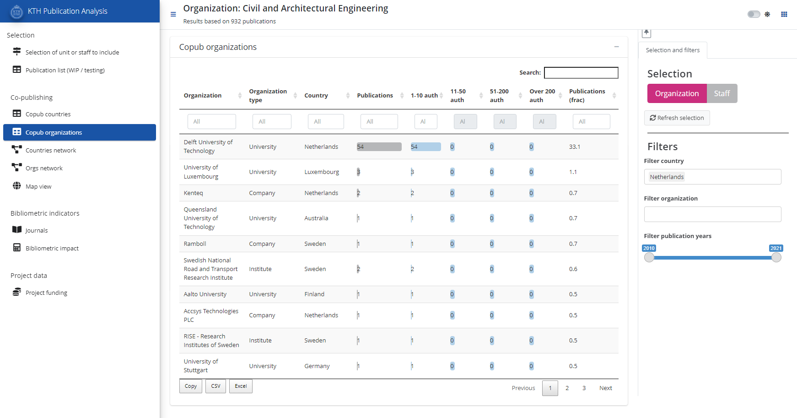

  
```{r setup, include=FALSE}
knitr::opts_chunk$set(echo = FALSE)

library(ktheme)
library(webshot)
library(DT)
library(ggplot2)
library(reshape2)
library(formattable)
library(readxl)
library(dplyr)
library(kableExtra)

red <- function(txt) 
  sprintf("<font color='%s'>\n%s\n</font>", tolower(palette_kth()["cerise"]), txt)
green <- function(txt) 
  sprintf("<font color='%s'>\n%s\n</font>", tolower(palette_kth()["olive"]), txt)

#webshot::install_phantomjs()
#unlink("retrosearch-screenshot.png")

suppressPackageStartupMessages(library(magick))

# BG images that could be used

```

## Agenda {data-background=assets/bg/kth-6.png data-background-size=cover}

- The **DAUF** project - "Datadriven Analys och Uppföljning av KTHs Forskning"

- Quick overview of some existing DAUF services/apps

- A demo of the **data curation tool** for DiVA publication and author data

- Update about **other efforts** (data consolidation and integration etc)

- A demo of the **"KTH Publication Analysis app"**

- Your **questions and feedback**

# Background and progress

## DAUF - background and context 

Trend towards `r green("better overview of research outputs")` as well as `r green("integration of systems.")`

<div align="center">
{width=640}
</div>

[Stanford RIALTO project](https://www.youtube.com/watch?v=7UgwzCKIU1A) (Youtube)

## DAUF - data curation

<div align="center">
{width=600}
</div>

- Researchers < > Outputs < > Projects

- DAUF has been building bottom-up data consolidation and analytics for KTH

## Current apps/services

- ABM/ÅBU - yearly reporting for KTH, schools and departments
  * Based on KTHs organization tree

- Staff-based ABM   
  * Same reporting format as ABM 
  * Based on current staff
  * Can be used at division level and above

- Analysis app  
  * "Live" data, possibility to filter and mine 
  * Ad-hoc groups
  * Copublication, maps and indicators
  
  
This is our current suggestion for how apps can be used.  
Possible point for discussion at the end.

## Projects at KTH

Need for data to answer questions like:

- Which projects are active? Which researchers are involved? Grant sizes?

- Current lack of coordination at KTH for project data

- Have started to look at possible data sources
  * Agresso data may not be suitable for this purpose 
  * investigating alternatives, e.g. SweCris & Cordis
  * other KTH-sources: CASE, W3D3
  
Our current aim is to get an overview of usable data, and gaps.
Can provide a baseline for how to proceed.

## Progress - What is new during Q1 2022? {data-background=assets/bg/plant.png data-background-size=cover}

- **KTH Publication Analysis app**
  * allowing exploration of co-publication and collaboration at KTH 
  * for ad-hoc research groups
  * rolling data (more up to date)
  
- **Curation tool for DiVA**

- **Infrastructure**
  * KTH OIDC
  * Server infrastructure
  * Integration with other reporting at KTH,  API output
  * Data consolidation in object storage (s3)
 

# Curation tool for DiVA data

## Curation tool for DiVA data

- Tool for ongoing curation of research output data (publications, authors)
- Aiming at interoperable data with good quality
- More efficient work-flows

{width=550,align='center'}

## Report for KTH publication corpus

[{width=800}](https://bibliometrics.lib.kth.se/qc/v1/check/report/)

## Data curation tools and data used

Data extracts can be copy/pasted from reports. There are other options, too:

- Downloads from *object storage (S3)*

- [Curator API](https://bibliometrics.lib.kth.se/curator/__docs__/) (authenticated)

- [Checks API](https://bibliometrics.lib.kth.se/qc/__docs__/) (partly authenticated)

<div align="center">
{width=300}
</div>

# Demo of KTH Publication Analysis app

## KTH Publication Analysis app

The goal of this app is to help answering some common questions, for example

- What does KTH collaboration with country X or university Y look like?
  * What is the bibliometric impact of this collaboration?

- What is the collaboration pattern and bibliometric impact of...
  * a KTH department, based on Diva affiliations?
  * staff currently or recently employed by some department or division?
  * some group at KTH not clearly defined in Diva or staff catalogue?
  * all the Postdocs at school Z?

## KTH Publication Analysis app

{width="90%"}

# Questions and feedback

## Questions and Answers

Please provide your input!

- Do you think the what was presented in the demonstration meets your needs for more analytical exploration for **collaboration and co-publication** at KTH?
- **Other questions** from the Zoom chat
- Suggestions and **comments**

If you prefer to provide written feedback, please use the following [jamboard](https://jamboard.google.com/d/1qJ9v6JyamDLPS82_qYg9l7scWkJcX8xVY0m6weazJCI/viewer)

Thank you for attending!
