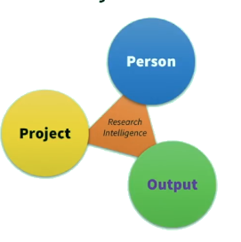
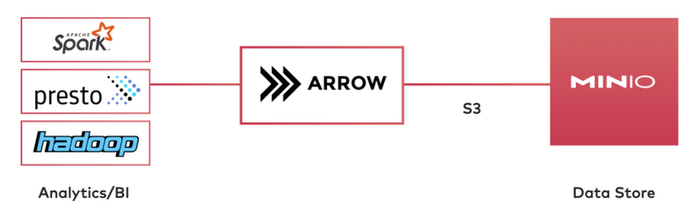
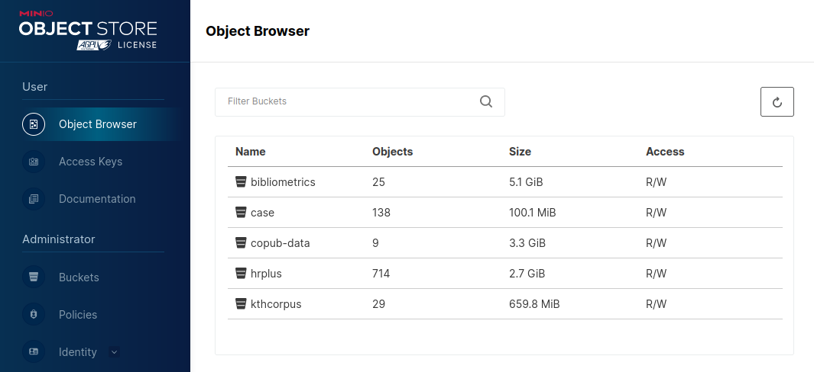

  
```{r setup, include=FALSE}
knitr::opts_chunk$set(echo = FALSE)
# install.packages("devtools")
library(ktheme)
library(webshot)
library(DT)
library(ggplot2)
library(reshape2)
library(formattable)
library(readxl)
library(dplyr)
library(kableExtra)
library(knitr)
library(htmltools)
library(htmlwidgets)

red <- function(txt) 
  sprintf("<font color='%s'>\n%s\n</font>", tolower(palette_kth()["cerise"]), txt)
green <- function(txt) 
  sprintf("<font color='%s'>\n%s\n</font>", tolower(palette_kth()["olive"]), txt)

#webshot::install_phantomjs()
#unlink("retrosearch-screenshot.png")

suppressPackageStartupMessages(library(magick))

# BG images that could be used

```

## Agenda {.smaller}

- The **DAUF** project - "Datadriven Analys och Uppföljning av KTHs Forskning"
- A demo of the **"KTH Publication Analysis app"** with projects data from CASE
- Overview of available data sources for projects at KTH
- Your **questions and feedback**
  
### About the project

- Collaboration within VS, between KTH-Library, RSO and ITA.  
- Agile model with 2 week sprints.  
- Creating services and tools for presentation of data, improved data flows and connecting data sources within KTH.

# Background and progress {data-background=assets/bg/kth-6.png data-background-size=cover}

## DAUF - background and context I

Trend towards `r green("better overview of research outputs")` as well as `r green("integration of systems.")`

<div align="center">
{width=640}
</div>

&emsp;&emsp;[Stanford RIALTO project](https://www.youtube.com/watch?v=7UgwzCKIU1A) (Youtube)

## Related, currently at KTH

- DAUF
- Data office (in progress)
- More support and management of research data
- Project to replace HR-system
- Strategisk verksamhetsanalys
- Updated budgeting tool


## Progress - What is new since the last demo meeting {data-background=assets/bg/plant.png data-background-size=cover}

- **KTH Publication Analysis app**
  * Allowing exploration of co-publication and collaboration at KTH 
  * For ad hoc research groups
  * Rolling data
  * CASE projects data

- **ABM, Annual Bibliometric Monitoring**
  * Sustainable Development Goals
  
- **Mobilizations of projects data from other sources**
  * CASE - “Case Management System for Research Projects” @ KTH
  * Swecris
  * CORDIS (EU projects)
  * Other sources

# Demo of KTH Publication Analysis app

## KTH Publication Analysis app

The idea is that the analysis app will complement the *Annual bibliometric monitoring* (ABM), and answer questions like:

- Who are the **main collaborating partners** to the division of Electric Power and Energy Systems?

- How large co-publication output between is the publication output of the department of Gene technology over time, in **co-publication with German organisations**?

- Which **senior staff at CBH is collaborating with MIT**, and what is the bibliometric performance of this research compared to CBH baseline? 
- What is the publication output and project count for an **ad hoc grouping of staff** related to a particular project?

## KTH Publication Analysis app - collaboration

https://analysis.sys.kth.se/bibliometrics/app_direct/publ_analysis

{width=950}

## KTH Publication Analysis app - project view

{width=950}

## Example based on TECoSA

[TECoSA](https://www.tecosa.center.kth.se/) (Trustworthy Edge Computing Systems and Applications) Centre running since 2020 used as example, based on 9 PIs.

- 462 publications 2010-2022
- 137 publications 2020-2022 (e.g. from the TECoSA-period)

- 28 projects in CASE - “Case Management System for Research Projects” @ KTH
- 14 projects 2020-2022 (seems to be more in CASE, but some with missing data on duration)
- Info on funders and SDG-goals on projects
- Picture of collaborations, through co-publication

# Data for projects at KTH {data-background=assets/bg/kth-5.png data-background-size=cover}

## DAUF and data about projects at KTH

DAUF has been building bottom-up data consolidation and analytics for KTH, making links between **Researchers** <-> **Outputs** <-> **Projects** <-> **Organisations**

<center>

</center>

"Which projects are active? Which researchers are involved? From which organisations? Grant sizes?"

## Definition of "project"?

There is no single "source of truth" for all projects at KTH. Data requirements depend on who asks the questions and for what purpose.

- What is a project, really? It is an amorphous/vague concept:
  - Externally financed research activity, i.e. requires that funder(s) and funding exists?
  - A call which has (not yet?) been awarded financing?
  - Internal ongoing "project work" - internally financed?
  - A way to topically group publications and their authors together?

> What are the most important questions you have in relation to projects at KTH?

## Mobilized data for KTH projects {.smaller}

### Object storage / S3 used

<center>
{height=100}
</center>

```{r echo=F}
#include_graphics(path = "assets/img/data source only.png")
library(dplyr)
library(tibble)

#readr::read_csv("https://data.bibliometrics.lib.kth.se/kthcorpus/projects_cordis.csv")

tribble(
  ~source, ~url, ~open, ~download_url, ~repo_url, ~rows, ~cols, ~freq,
  "Formas", "https://formas.se/en/start-page/about-formas/what-we-do/open-data---api-containing-information-on-funded-projects/documentation-for-api-containing-information-on-funded-projects.html", TRUE, "projects_formas.csv", "formas", 471, 21, "daily",
  "OpenAIRE", "https://graph.openaire.eu/develop/api.html#projects", TRUE, "projects_openaire.csv", "OpenAIRE", 813, 10, "daily",
  "Swecris", "https://swecris-api.vr.se/index.html", TRUE, "projects_swecris.csv", "swecris", 3165, 26, "daily",
  "Vinnova", "https://www.vinnova.se/en/about-us/about-the-website/open-data/", TRUE, "projects_vinnova.csv", "vinnova", 442, 20, "daily",
  "CORDIS", "https://data.europa.eu/data/datasets/cordis-eu-research-projects-under-horizon-europe-2021-2027?locale=en", TRUE, "projects_cordis.csv", "cordis", 753, 20, "monthly",
  "CASE", "https://confluence.sys.kth.se/confluence/pages/viewpage.action?pageId=70785591", FALSE, "", "bibliotools", 2647, 40, "daily"
  ) |>
  mutate(open = ifelse(open, "🟢", "🔒")) |>
  mutate(repo_url = sprintf("<a href='https://github.com/KTH-Library/%s' target='blank'>%s</a>", repo_url, repo_url)) |>
  mutate(source = sprintf("<a href='%s' target='blank'>%s</a>", url, source)) |>
  mutate(download_url = ifelse(nzchar(download_url) < 1, "<a href='https://data.bibliometrics.lib.kth.se' target='blank'>Authenticated S3 bucket</a>", glue::glue("<a href='https://data.bibliometrics.lib.kth.se/kthcorpus/{download_url}' target='blank'>{download_url}</a>", .na = NULL))) |> #, download_url, download_url)) |>
  select(-url) |>
  DT::datatable(escape = F, rownames = F, colnames = c(
    Source = "source",
    Access = "open",
    Download = "download_url",
    Tools = "repo_url", 
    Records = "rows",
    Fields = "cols",
    Updates = "freq"
  ), options = list(dom = ""))  
```

## Tooling and components {.smaller}

<center>
{height=250}
</center>

### Tools
- ["kthcorpus" - open repo, publication and authors in DiVA etc](https://github.com/KTH-Library/kthcorpus)
- ["institutions" - open repo, organisation identifers etc](https://github.com/KTH-Library/institutions)
- ["bibliotools" - private repo, access to CASE data](https://github.com/KTH-Library/bibliotools)

# External data sources for KTH Projects - Overview {data-background=assets/bg/kth-1.png data-background-size=cover}

## CASE: a Research Management process in Edge

- Internal source at KTH (Efecte Edge) - a "Case Management System for Research Projects"
- Keeps track of agreements, contracts, legal documents
- Could be a good source for internally financed projects
- Can complement what is missing from other open sources
- Comparatively more diverse (project types, funding organizations)

## CASE (I/II) - fields and missingness {.smaller}

```{r echo=F,out.width="50%",fig.align='center'}
# - <Overview here - nr of records, update frequency, fields available, keys>
include_graphics(path = "assets/img/Case overview.png")
```

## CASE (II/II) 

- <font size="5">Encompasses projects that have received funding from 29 different agencies, covering a time frame from 2009 to 2024</font>

- <font size="5">Although information on funding organizations is available, it remains insufficient and requires improvement (e.g. 22% are NA)</font>

```{r echo=F,out.width="100%",fig.align='default'}
include_graphics(path = "assets/img/Case funding.png")
```

## Swecris {.smaller}

- There are seven funding agencies in Swecris
- Noticeably, the share of missing information of Primary Researcher and Leading role is moderately high, ca 20%

```{r echo=F,out.width="55%",fig.align='center'}
# - <Overview here - nr of records, update frequency, fields available, keys>
include_graphics(path = "assets/img/sweCris overview.png")
```

## CORDIS

[Synergies and Challenges of Integrating Heterogeneous KTH Project Datasets](sweCrisQo.html)

```{r echo=F,out.width="50%",fig.align='center'}
include_graphics(path = "assets/img/cordis overview.png")
```

## OpenAIRE

[Synergies and Challenges of Integrating Heterogeneous KTH Project Datasets](sweCrisQo.html)

```{r echo=F,out.width="55%",fig.align='center'}
include_graphics(path = "assets/img/openAire overview.png")
```

## Combining data sources for KTH projects

Overlap - Unions and intersections for different data sources
```{r echo=F,out.width="100%",fig.align='center'}
include_graphics(path = "assets/img/Dataflow-and-entity-graph.png")
```

## CASE versus Swecris - 174 exact matches found

```{r echo=F,out.width="100%",fig.align='center'}
#   + <font size="4">The use of orCid ID's returned 986 projects from sweCris of which 91 observations could subsequently be matched with Case based on a fuzzy-matching of research title.</font>
include_graphics("assets/img/Table.3.png")
```

## Why the discrepancy?

```{r echo=F,out.width="90%",fig.align='center'}
include_graphics("assets/img/typebyyear.png")
```

[Details: Combining CASE with Swecris](Case-Presentation.html)

## Project data - discussion

- Do you have a need to follow-up projects from both the "contract" perspective and the "research area/topic" perspective?
- Define purpose and use data from the most relevant sources. Should CASE be used to complement other external sources? 

# Discussion, Questions, Feedback {data-background=assets/bg/kth-2.png data-background-size=cover}

## Future work and directions

Determined based on your input and directions provided by product owners.

- Subject area analysis in KTH Publication Analysis app
  - UKÄ/SCB categories
  - Topic clusters and keywords
  - Journal classifications
  
- Improved filtering
- Preliminary merged project list (based on CASE + external sources)


## Questions and Answers {.smaller}

Please provide your input!

- Do you have a need to follow-up projects from both the **"contract"** perspective and the **"research area/topic"** perspective?
- Do you have ideas for **additional reference datasets** that are useful for analyzing your projects at KTH?
- Would **parameterized interactive reports** be useful in addition to the raw data and the app?
- **Other questions** from the Zoom chat
- Suggestions and **comments**?

If you prefer to provide written feedback, please use the following [jamboard](https://jamboard.google.com/d/17xE5Pxs339c3Teco5DeuTAaz9EbJGdtNQCI6u5lEW3o/viewer).

Thank you for attending!
