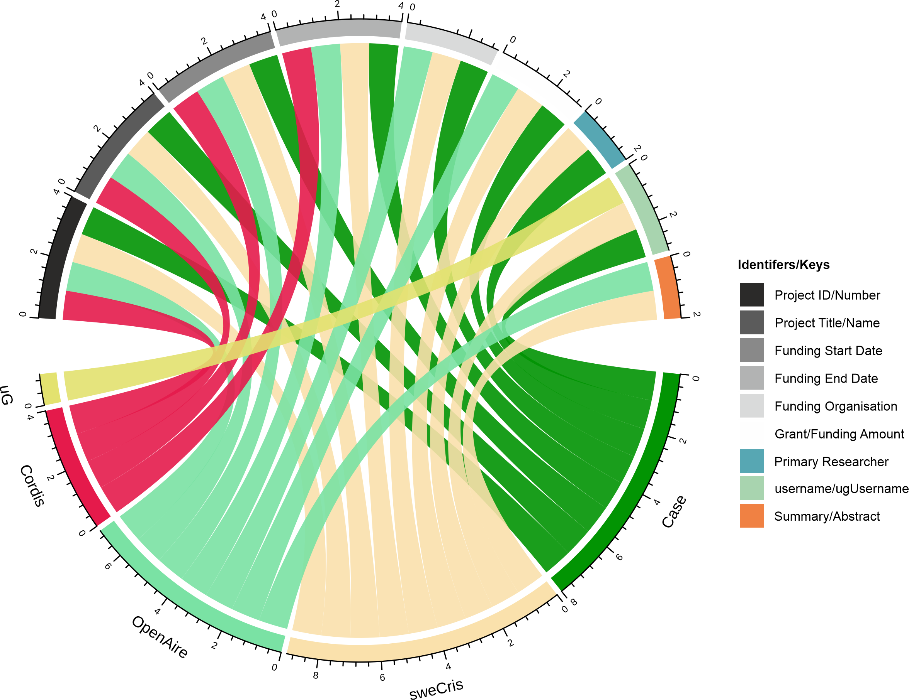
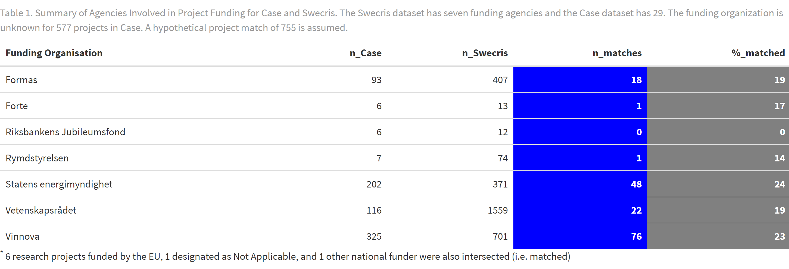

  
```{r setup, include=FALSE}
knitr::opts_chunk$set(echo = FALSE)
# install.packages("devtools")
library(ktheme)
library(webshot)
library(DT)
library(ggplot2)
library(reshape2)
library(formattable)
library(readxl)
library(dplyr)
library(kableExtra)
library(knitr)

red <- function(txt) 
  sprintf("<font color='%s'>\n%s\n</font>", tolower(palette_kth()["cerise"]), txt)
green <- function(txt) 
  sprintf("<font color='%s'>\n%s\n</font>", tolower(palette_kth()["olive"]), txt)

#webshot::install_phantomjs()
#unlink("retrosearch-screenshot.png")

suppressPackageStartupMessages(library(magick))

# BG images that could be used

```

## Agenda

- The **DAUF** project - "Datadriven Analys och Uppföljning av KTHs Forskning"

- A demo of the **"KTH Publication Analysis app"** with projects data from CASE

- Overview of available data sources for projects at KTH

- Your **questions and feedback**

# Background and progress {data-background=assets/bg/kth-6.png data-background-size=cover}

## DAUF - background and context 

Trend towards `r green("better overview of research outputs")` as well as `r green("integration of systems.")`

<div align="center">
{width=640}
</div>

[Stanford RIALTO project](https://www.youtube.com/watch?v=7UgwzCKIU1A) (Youtube)

## Progress - What is new during Q1 2023? {data-background=assets/bg/plant.png data-background-size=cover}

- **KTH Publication Analysis app**
  * allowing exploration of co-publication and collaboration at KTH 
  * for ad-hoc research groups
  * rolling data
  * CASE projects data
  
- **Mobilizations of projects data from other sources**
  * CASE
  * SweCris
  * CORDIS (EU projects)
  * Other sources

# Demo of KTH Publication Analysis app

## KTH Publication Analysis app

The goal of this app is to help answering some common questions, for example:

- Who are the main collaborating partners of division X?
- How large is the publication output of department Y over time, in copublication with German organisations?
- Which senior staff at CBH is collaborating with MIT, and what is the bibliometric performance of this research compared to CBH baseline? 
- What is the publication output and project count of the staff related to project X (ad-hoc group of KTH staff)

The idea is that the analysis app will complement the *Annual bibliometric monitoring* (ABM).

## KTH Publication Analysis app

- Screenshot 

## Example based on TECoSA

[TECoSA](https://www.tecosa.center.kth.se/) Centre running since 2020 used as example, based on 9 PIs.

Some summary stats:

- 619 publications 2010-2021
- 96 publications 2020-2021 (e.g from the TECoSA-period)

- 39 projecs in CASE
- 13 projects 2020-2021 (seems to be more in CASE, but some with missing data on duration)
- Info on funders and SDG-goals on projects
- Picture of collaborations, through co-publication

# Data for projects at KTH {data-background=assets/bg/kth-5.png data-background-size=cover}

## DAUF and data about projects

- DAUF has been building bottom-up data consolidation and analytics for KTH, making links between Researchers <-> Outpus <-> Projects

- "Which projects are active? Which researchers are involved? Grant sizes?"

- What is a project, really? It is an amorphous concept:
  - Externally financed research activity, ie funders and funding exists?
  - Internal ongoing "project work" - internal (or not financed at all)?
  - A call which has (not yet?) been awarded financing?
  - A way to group publications and their authors together?

- There is no single "source of truth" for all projects at KTH
  - Data requirements depend on who asks the questions and for what purpose
  
## Data sources for projects

- Overview of available data sources
  - <font size="2">Descriptions of data sources</font>
  - <font size="2">Data flows and access</font>
  - <font size="2">Combining data sources for KTH projects</font>
  
```{r echo=F,out.width="40%",fig.align='center',fig.cap="Data-driven flowchart. Data wrangling, exploratory data analysis, and data enrichment"}
include_graphics(path = "assets/img/DataDriven-Flowchart.png")
```

## CASE

- <Overview here - nr of records, update frequency, fields available, keys>

```{r echo=F,out.width="60%",fig.align='center',fig.cap="Pareto chart for missing values (counts and proportions) in Case"}
include_graphics(path = "assets/img/Case-data-Quality.jpg")
```

## SweCris

- <Overview here - nr of records, update frequency, fields available, keys>

```{r echo=F,out.width="60%",fig.align='center'}
include_graphics(path = "assets/img/swecris-fig-2.png")
```

## CORDIS

- <Overview here - nr of records, update frequency, fields available, keys>

```{r echo=F,out.width="30%",fig.align='center'}
include_graphics(path = "assets/img/Summary graph.png")
```

## Other sources

- <Overview here - nr of records, update frequency, fields available, keys>

## Combining data sources for projects

- <Overlap - Unions and intersections for different data sources>

```{r echo=F,out.width="60%",fig.align='center',fig.cap="Entity/Relationship (ER) diagram. Shared identifiers among specific relational databases (RDB)."}

```

## Selection (Urval)

```{r echo=F,out.width="80%",fig.align='center'}

```

## Future work and directions

- <Product Owners, Future Outlook>
- Subject area analysis
  - UKÄ/SCB categories
  - Topic clusters and keywords
  - Journal classifications

# Questions and feedback

## Questions and Answers {.smaller}

Please provide your input!

- Do you think what was presented in the demonstration meets **your needs for analytical exploration**?
- Would **additional reference datasets** be needed?
- Would additional ways to **slice and dice** the data along other dimensions be useful?
- Would **parameterized interactive reports** be useful in addition to the raw data and the app?
- Are metrics related to **author sequence/order** useful?
- **Other questions** from the Zoom chat
- Suggestions and **comments**

If you prefer to provide written feedback, please use the following [jamboard](https://jamboard.google.com/d/1qJ9v6JyamDLPS82_qYg9l7scWkJcX8xVY0m6weazJCI/viewer)

Thank you for attending!
