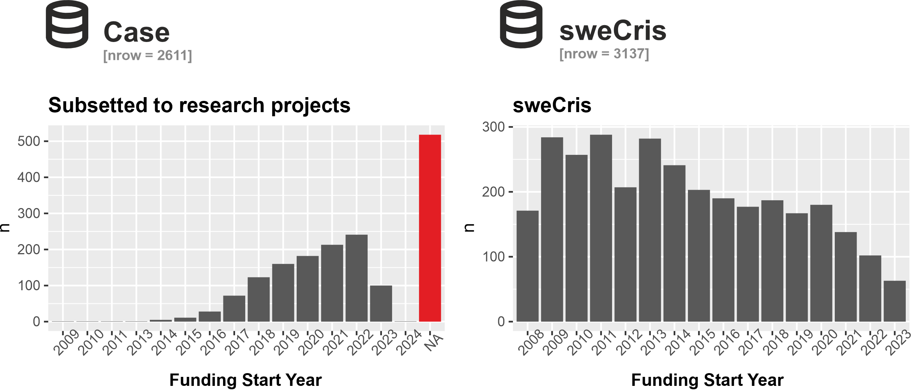

  
```{r setup, include=FALSE}
knitr::opts_chunk$set(echo = FALSE)
# install.packages("devtools")
library(ktheme)
library(webshot)
library(DT)
library(ggplot2)
library(reshape2)
library(formattable)
library(readxl)
library(dplyr)
library(kableExtra)
library(knitr)
library(htmltools)
library(htmlwidgets)

red <- function(txt) 
  sprintf("<font color='%s'>\n%s\n</font>", tolower(palette_kth()["cerise"]), txt)
green <- function(txt) 
  sprintf("<font color='%s'>\n%s\n</font>", tolower(palette_kth()["olive"]), txt)

#webshot::install_phantomjs()
#unlink("retrosearch-screenshot.png")

suppressPackageStartupMessages(library(magick))

# BG images that could be used

```

## Agenda

- The **DAUF** project - "Datadriven Analys och Uppföljning av KTHs Forskning"

- A demo of the **"KTH Publication Analysis app"** with projects data from CASE

- Overview of available data sources for projects at KTH

- Your **questions and feedback**

# Background and progress {data-background=assets/bg/kth-6.png data-background-size=cover}

## DAUF - background and context 

Trend towards `r green("better overview of research outputs")` as well as `r green("integration of systems.")`

<div align="center">
{width=640}
</div>

&emsp;&emsp;[Stanford RIALTO project](https://www.youtube.com/watch?v=7UgwzCKIU1A) (Youtube)

## Related, currently at KTH

- DAUF
- Data office (in progress)
- More support and management of research data
- Project to replace HR-system


## Progress - What is new during Q1 2023? {data-background=assets/bg/plant.png data-background-size=cover}

- **KTH Publication Analysis app**
  * allowing exploration of co-publication and collaboration at KTH 
  * for ad-hoc research groups
  * rolling data
  * CASE projects data

- **ABM**
  * Sustainable Development Goals
  
- **Mobilizations of projects data from other sources**
  * CASE
  * SweCris
  * CORDIS (EU projects)
  * Other sources

# Demo of KTH Publication Analysis app

## KTH Publication Analysis app

The idea is that the analysis app will complement the *Annual bibliometric monitoring* (ABM), and answer questions like:

- Who are the *main collaborating partners* to the division of Electric Power and Energy Systems?
- How large is the publication output of the department of Gene technology over time, in **co-publication with German organisations**?
- Which **senior staff at CBH is collaborating with MIT**, and what is the bibliometric performance of this research compared to CBH baseline? 
- What is the publication output and project count for an **ad hoc grouping of staff** related to a particular project?

## KTH Publication Analysis app - example

https://analysis.sys.kth.se/bibliometrics/app/publ_analysis

{width=950}

## Example analysis app - project view

{width=950}

## Example based on TECoSA

[TECoSA](https://www.tecosa.center.kth.se/) Centre running since 2020 used as example, based on 9 PIs.

Some summary stats:

- 462 publications 2010-2022
- 137 publications 2020-2022 (e.g. from the TECoSA-period)

- 28 projects in CASE
- 14 projects 2020-2021 (seems to be more in CASE, but some with missing data on duration)
- Info on funders and SDG-goals on projects
- Picture of collaborations, through co-publication

# Data for projects at KTH {data-background=assets/bg/kth-5.png data-background-size=cover}

## DAUF and data about projects

- DAUF has been building bottom-up data consolidation and analytics for KTH, making links between *Researchers* <-> *Outputs* <-> *Projects* <-> *Organisations*

- "Which projects are active? Which researchers are involved? Grant sizes?"

## Definition of "project"?

There is no single "source of truth" for all projects at KTH. Data requirements depend on who asks the questions and for what purpose.

- What is a project, really? It is an amorphous/vague concept:
  - Externally financed research activity, i.e. requires that funder(s) and funding exists?
  - A call which has (not yet?) been awarded financing?
  - Internal ongoing "project work" - internally financed?
  - A way to topically group publications and their authors together?


## Data sources for projects {.columns-2 .smaller}

<style>
.forceBreak { -webkit-column-break-after: always; break-after: column; }
</style>

### Overview of available data sources

- <font size="5">Descriptions of data sources</font>
- <font size="5">Data flows and access</font>
- <font size="5">Combining data sources for KTH projects</font>

```{r echo=F,out.width="70%"}
include_graphics(path = "assets/img/data source only.png")
```

## CASE (I/II) {.smaller}

An internal project management system at KTH, mainly used by the schools and RSO.

```{r echo=F,out.width="50%",fig.align='center'}
# - <Overview here - nr of records, update frequency, fields available, keys>
include_graphics(path = "assets/img/Case overview.png")
```

## CASE (II/II) 

- <font size="5">Encompasses projects that have received funding from 29 different agencies, covering a time frame from 2009 to 2024</font>

- <font size="5">Although information on funding organizations is available, it remains insufficient and requires improvement (e.g. 22% are NA)</font>

```{r echo=F,out.width="100%",fig.align='default'}
include_graphics(path = "assets/img/Case funding.png")
```

## Swecris {.smaller}

- There are seven funding agencies in Swecris
- Noticeably, the share of missing information of Primary Researcher and Leading role is moderately high, ca 20%

```{r echo=F,out.width="50%",fig.align='center'}
# - <Overview here - nr of records, update frequency, fields available, keys>
include_graphics(path = "assets/img/sweCris overview.png")
```

## CORDIS

```{r echo=F,out.width="55%",fig.align='center'}
include_graphics(path = "assets/img/cordis overview.png")
```

- bullet p1
- bullet p2

## OpenAIRE

```{r echo=F,out.width="55%",fig.align='center'}
include_graphics(path = "assets/img/openAire overview.png")
```

- bullet p1
- bullet p2

## Combining data sources for projects

- Overlap - Unions and intersections for different data sources

```{r echo=F,out.width="100%",fig.align='center'}
include_graphics(path = "assets/img/Dataflow-and-entity-graph.png")
```

## Case versus Swecris

  + <font size="4">In total, 174 unique KTH research projects could be matched with Swecris.</font> 
  
```{r echo=F,out.width="100%",fig.align='center'}
#   + <font size="4">The use of orCid ID's returned 986 projects from sweCris of which 91 observations could subsequently be matched with Case based on a fuzzy-matching of research title.</font>
include_graphics("assets/img/Table.3.png")
```

## Why the discrepancy?

```{r echo=F,out.width="90%",fig.align='center'}

```

## Project data - discussion

- Do you have a need to follow-up projects from both the "contract" perspective and the "research subject" perspective?
- xx
- yy

## Future work and directions

- <Product Owners, Future Outlook>
- Subject area analysis
  - UKÄ/SCB categories
  - Topic clusters and keywords
  - Journal classifications

# Questions and feedback

## Questions and Answers {.smaller}

Please provide your input!

- Do you think what was presented in the demonstration meets **your needs for analytical exploration**?
- Would **additional reference datasets** be needed?
- Would additional ways to **slice and dice** the data along other dimensions be useful?
- Would **parameterized interactive reports** be useful in addition to the raw data and the app?
- Are metrics related to **author sequence/order** useful?
- **Other questions** from the Zoom chat
- Suggestions and **comments**

If you prefer to provide written feedback, please use the following [jamboard](https://jamboard.google.com/d/1qJ9v6JyamDLPS82_qYg9l7scWkJcX8xVY0m6weazJCI/viewer)

Thank you for attending!
