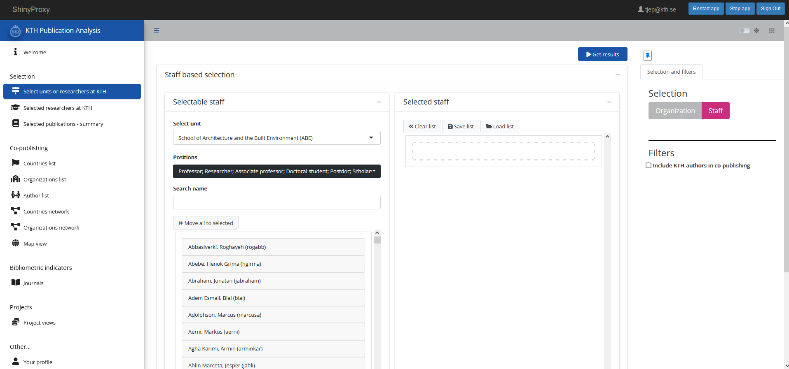
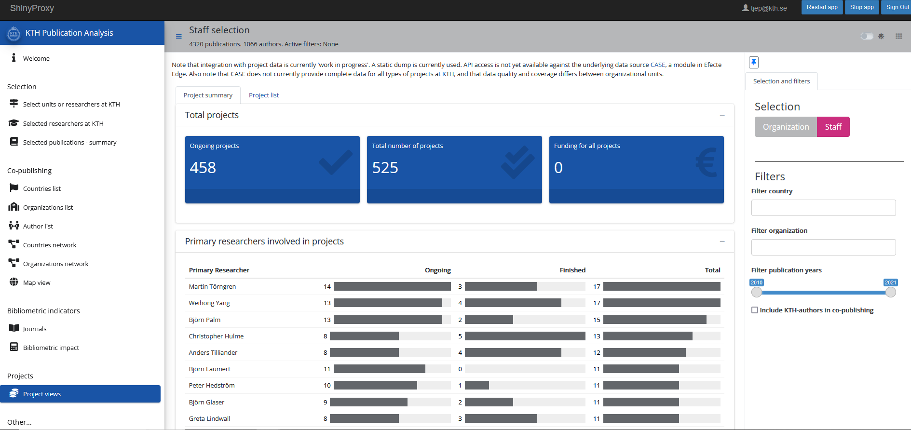

  
```{r setup, include=FALSE}
knitr::opts_chunk$set(echo = FALSE)

library(ktheme)
library(webshot)
library(DT)
library(ggplot2)
library(reshape2)
library(formattable)
library(readxl)
library(dplyr)
library(kableExtra)

red <- function(txt) 
  sprintf("<font color='%s'>\n%s\n</font>", tolower(palette_kth()["cerise"]), txt)
green <- function(txt) 
  sprintf("<font color='%s'>\n%s\n</font>", tolower(palette_kth()["olive"]), txt)

#webshot::install_phantomjs()
#unlink("retrosearch-screenshot.png")

suppressPackageStartupMessages(library(magick))

# BG images that could be used

```

## Background & DAUF-project {data-background=assets/bg/kth-6.png data-background-size=cover}

The **DAUF** project - "Datadriven Analys och Uppföljning av KTHs Forskning"
  
- Started with project to develop/refresh the the [*Annual bibliometric monitoring*](https://kth.se/abm) (ABM/ÅBU)
  - Collaboration between KTH Library and IT
  - Presentation of KTH research output  
    Started from bibliometric data
  - Collation of relevant data sources at KTH  
    Publications, staff/HR, projects ...
  - Servers and data layers
  
## Applications and services

- [*Annual bibliometric monitoring*](https://kth.se/abm) (ABM/ÅBU)
- Data curation tool for DiVA publication data
- Publication analysis (++)
- R-packages to interact with KTH-relevant data (kthcorpus, kthapi, ktheme, at [Github](https://github.com/KTH-Library))
- Some APIs

## The analysis app

Allows for analysis of (some dimensions) of research output

Under active development and deployed on local servers, at: https://analysis.sys.kth.se/bibliometrics/app/publ_analysis

 - Organization view (used in ABM) and staff-based view
 - Ad-hoc groups or staff categories
 - "Live" data
 - Co-publication and bibliometric performance
 - Filtering
 - Project data (currently from CASE)
    * Added yesterday!
 
## Example

Selection view 

<div align="center">
{width=1000}

## Example

Co-publication example

<div align="center">
{width=1000}

## Example

Project view

<div align="center">
{width=1000}

## Demo of TECoSA

Demo of [TECoSA](https://www.tecosa.center.kth.se/), based on 9 PIs  
Centre running since 2020.

Some summary stats:

- 619 publications 2010-2021
- 96 publications 2020-2021 (e.g from the TECoSA-period)

- 39 projecs in CASE
- 13 projects 2020-2021 (seems to be more in CASE, but some with missing data on duration)


## Take-away

* Can catch centres and research groups, by ad-hoc selection and saved groups
* Unified view of publications, staff and project data (to some extent)
* Can help in reporting and monitoring(?)

## To-do and limitations

To-do:

- Adding filters for projects
- Adding subject categorisation (publications)

Limitations:

- Only based on KTH researchers
- Limitations to project data at KTH 
  * Only PIs
  * Limited economic data
  * Uneven quality among schools
  * System not originally created for project management in a broader sense
- Co-publication data and bibliometrics currently based on Web of Science

## 