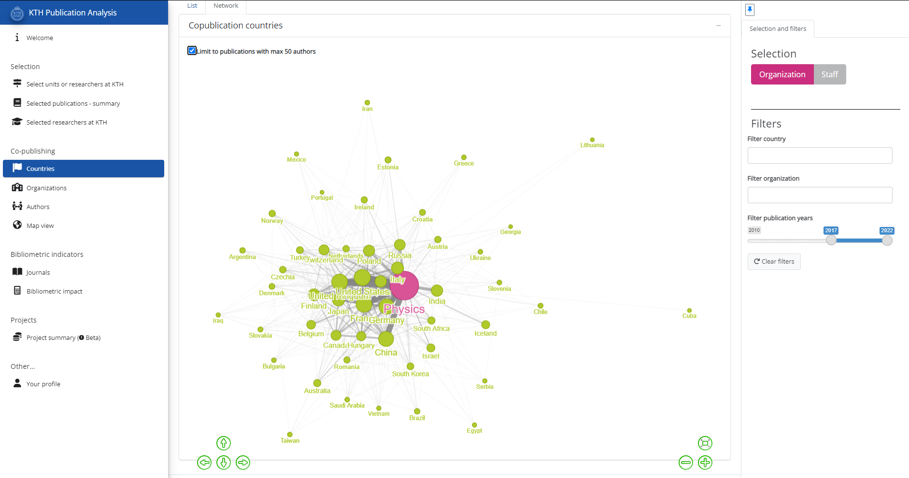

  
```{r setup, include=FALSE}
knitr::opts_chunk$set(echo = FALSE)

library(ktheme)
library(webshot)
library(DT)
library(ggplot2)
library(reshape2)
library(formattable)
library(readxl)
library(dplyr)
library(kableExtra)

red <- function(txt) 
  sprintf("<font color='%s'>\n%s\n</font>", tolower(palette_kth()["cerise"]), txt)
green <- function(txt) 
  sprintf("<font color='%s'>\n%s\n</font>", tolower(palette_kth()["olive"]), txt)

#webshot::install_phantomjs()
#unlink("retrosearch-screenshot.png")

suppressPackageStartupMessages(library(magick))

# BG images that could be used

```

##

- The **DAUF** project - "Datadriven Analys och Uppföljning av KTHs Forskning"

- A demo of the **"KTH Publication Analysis app"**

- **Questions and feedback**

## DAUF - background

- Started as "ABM project" to create a more user friendly and easier to maintain [Annual Bibliometric Monitoring](https://kth.se/abm).
- Identified other/more needs, for example
  - Examine co-publication deeper
  - Select groups of researchers for analysis
  - Collect and present data about research projects
- Publication analysis tool under development - ["KTH Publication Analysis"](https://analysis.sys.kth.se/bibliometrics/app/publ_analysis)

## KTH Publication Analysis app

The goal of this app is to help answering some common questions, for example:

- A delegation from Portugal is visiting KTH
  - Who are our co-publication partners in Portugal?
  - Who at KTH co-publish with Portugal?
- How is department X...
  - co-publishing?
  - performing bibliometrically?
- What projects are associated with research group Y?

## KTH Publication Analysis app

[{height=500}](https://analysis.sys.kth.se/bibliometrics/app/publ_analysis)

## Future directions

- Subject areas
  - UKÄ/SCB categories
  - Topic clusters and keywords
  - Journal classifications

- More journal information
  - Open Access
  - Bibliometric indicators

- Research projects
  - Merge data from several sources

## Questions and feedback

Please provide your input!

- Is the KTH Publication Analysis tool useful for you?
- Would additional ways to slice and dice the data along other dimensions be useful?
- Would parameterized interactive reports be useful?
- Would you like other lists and/or graphs to be available in the tool?
- Other questions or suggestions?
