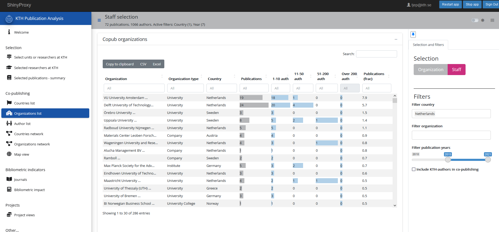
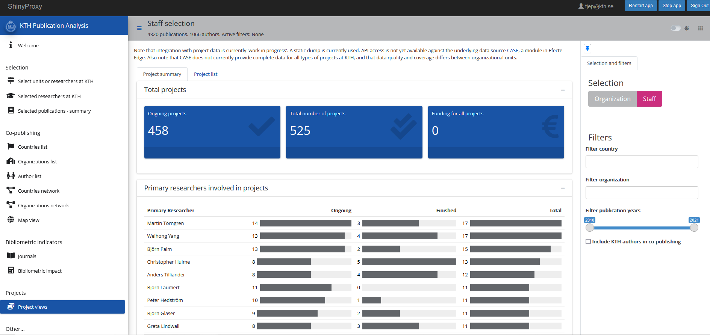

  
```{r setup, include=FALSE}
knitr::opts_chunk$set(echo = FALSE)

library(ktheme)
library(webshot)
library(DT)
library(ggplot2)
library(reshape2)
library(formattable)
library(readxl)
library(dplyr)
library(kableExtra)

red <- function(txt) 
  sprintf("<font color='%s'>\n%s\n</font>", tolower(palette_kth()["cerise"]), txt)
green <- function(txt) 
  sprintf("<font color='%s'>\n%s\n</font>", tolower(palette_kth()["olive"]), txt)

#webshot::install_phantomjs()
#unlink("retrosearch-screenshot.png")

suppressPackageStartupMessages(library(magick))

# BG images that could be used

```

## DAUF-projektet {data-background=assets/bg/kth-6.png data-background-size=cover}

**Datadriven Analys och Uppföljning av KTH:s Forskning**
  
* Startade som ett projekt för att förbättra och modernisera [**ÅBU**](https://kth.se/abm)
* Samarbete mellan KTHB och ITA
* Agilt arbetssätt, sprintar á 2 veckor
* Presentera KTH:s forskningsoutput
* Samlar ihop data från olika källor
  + Publikationer och KTH-affilieringar (DiVA)
  + Citeringar, affilieringar, nyckelord etc (WoS, Scopus)
  + Personal (HR)
  + Projekt (CaSE, Swecris, Cordis)
  + Open Access, Altmetrics mm
* Tjänster i Docker-containrar, data i S3-object, "buckets"

## Appar och andra resurser

- [ÅBU](https://kth.se/abm) (Årlig bibliometrisk uppföljning)
- KuraTHor - Datakureringsverktyg för DiVA
- [Analysapp](https://analysis.sys.kth.se/bibliometrics/app/publ_analysis)
- R-paket för att interagera med relevanta data (kthcorpus, kthapi, ktheme etc, se [Github](https://github.com/KTH-Library))
- API:er

## Analysappen

Möjliggör analys av (vissa aspekter av) forskningsoutput

Utvecklas aktivt och publiceras på https://analysis.sys.kth.se/bibliometrics/app/publ_analysis

* Urval via organisation (som i ÅBU) eller personer
* Skapa persongrupper eller filtrera på personalkategorier
* Senast tillgängliga data
* Sampublicering
* Bibliometrisk prestation
* Filtrering på land, organisation och publikationsår
* Projektdata (just nu från CASE)
 
## Exempel

Urvalsvy

<div align="center">
{width=1000}

## Exempel

Sampublicering - länder och organisationer

<div align="center">
{width=1000}

## Exempel

Projektvy

<div align="center">
{width=1000}

## [Demo](https://analysis.sys.kth.se/bibliometrics/app/publ_analysis)

## Framtidsplaner och begränsningar

**Troliga närmaste tillägg**

* Ämneskategorier - visa upp och möjliggör filtrering
* Mer tidskriftsinformation
* Filtrera bland projekt

**Begränsningar i dagsläget**

* Endast KTH-forskare
* Endast Web of Science-publikationer
* Projektdata på KTH innehåller:
  + Bara PI:s (Primary Investigator)
  + Begränsade ekonomidata
  + Ojämn kvalitet mellan skolor

## Uppgift till PIM

Gå till https://analysis.sys.kth.se/bibliometrics/app/publ_analysis

I grupper om 2-3 personer, försök under de närmaste 20 minuterna svara på några av dessa frågor:

* asdf
* sdfa
* dfas
* fasd

Skriv gärna ner medan ni håller på om ni fastnar någonstans och om ni har förslag
på förbättringar av gränssnittet, e-posta isåfall till Tobias eller Agne.
