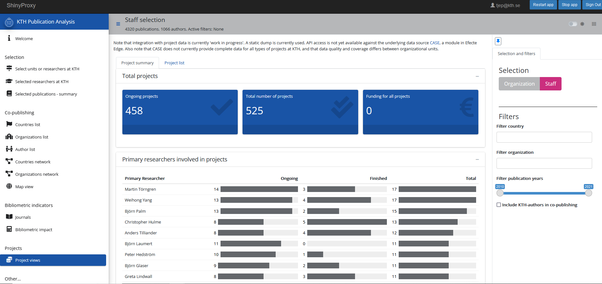

  
```{r setup, include=FALSE}
knitr::opts_chunk$set(echo = FALSE)

library(ktheme)
library(webshot)
library(DT)
library(ggplot2)
library(reshape2)
library(formattable)
library(readxl)
library(dplyr)
library(kableExtra)

red <- function(txt) 
  sprintf("<font color='%s'>\n%s\n</font>", tolower(palette_kth()["cerise"]), txt)
green <- function(txt) 
  sprintf("<font color='%s'>\n%s\n</font>", tolower(palette_kth()["olive"]), txt)

#webshot::install_phantomjs()
#unlink("retrosearch-screenshot.png")

suppressPackageStartupMessages(library(magick))

# BG images that could be used

```

##
**DAUF - Datadriven Analys och Uppföljning av KTH:s Forskning**

* Startade som ett projekt för att förbättra och modernisera [**ÅBU**](https://kth.se/abm)
* Samarbete mellan KTHB och ITA
* Agilt arbetssätt, sprintar á 2 veckor
* Presentera KTH:s forskningsoutput
* Samlar ihop data från olika källor
  + Publikationer och KTH-affilieringar (DiVA)
  + Citeringar, affilieringar, nyckelord etc (WoS, Scopus)
  + Personal (HR)
  + Projekt (CaSE, Swecris, Cordis)
  + Open Access, Altmetrics mm
* Tjänster i Docker-containrar, data i S3-object, "buckets"

## Tjänster / resurser

- [ÅBU](https://kth.se/abm) (Årlig bibliometrisk uppföljning)
- KuraTHor - Datakureringsverktyg för DiVA
- [KTH Research Information](https://analysis.sys.kth.se/bibliometrics/app/publ_analysis)
- R-paket för att interagera med relevanta data, se [Github](https://github.com/KTH-Library))
- API:er

Se även dokumentation på:

- https://dauf-prod.sys.kth.se/ (Ny, kommer byta till nedanstående adress)
- https://bibliometrics.lib.kth.se/ (Gammal, innehållet kommer att bli ovanstående)


## KTH Research Information

Möjliggör analys av (vissa aspekter av) forskningsoutput

Utvecklas aktivt och hittas på https://analysis.sys.kth.se/bibliometrics/app/publ_analysis

* Urval via organisation (som i ÅBU) eller personer
* Skapa persongrupper eller filtrera på personalkategorier
* Senast tillgängliga data i Bibmet
* Sampublicering
* Bibliometrisk prestation
* Filtrering på land, organisation och publikationsår
* Projektdata (just nu från CASE)
 
## Exempel

Urvalsvy

<div align="center">
{width=1000}

## Exempel

Sampublicering - länder och organisationer

<div align="center">
{width=1000}

## Exempel

Projektvy

<div align="center">
{width=1000}

## [Demo](https://analysis.sys.kth.se/bibliometrics/app/publ_analysis)

## Uppgift till SoU

Gå till https://analysis.sys.kth.se/bibliometrics/app/publ_analysis

I grupper om 2-3 personer, försök under de närmaste 15 minuterna svara på några av frågorna på följande sida.

För gärna anteckningar gruppvis medan ni håller på om ni fastnar någonstans eller har förslag på förbättringar 
av gränssnittet.

Varje grupp återrapporterar kort hur övningarna gick.  

E-posta gärna även kommentarer och förslag till Agne (agnel@kth.se).

## Uppgift till SoU - frågeställningar

1. Ta fram organisationsbaserade resultat för institutionen "Fibre and Polymer technology" och notera deras andel bibliometriska resultat för Top10% för 2018-2020. Notera även vilka 2 organisationer de oftast sampublicerar med. 

2. Ta fram personalbaserade resultat för alla anställda på "Electric power and Energy Systems". Notera hur många publikationer de sampublicerat med USA mellan åren 2015-2021, och vilka 3 organisationer som ingår oftast i dessa samarbeten.

3. Välj ut alla professorer och docenter (associate professor) från institutionerna "Chemistry" och "Chemical engineering" och ta fram resulat för grupperingen. Notera hur många projekt som finns kopplade till dessa personer i CASE, och vilka två organisationer som finansierar flest projekt.  

4. Ta fram organisationsbaserade resultat för hela ITM-skolan, och filtrera fram samarbeten med Münchens tekniska universitet (Technical University of Munich, TUM). Notera vilka 2 forskare från KTH resp. TUM som oftast ingår i dessa samarbeten.

## Återrapportering och reflektion

Hur gick övningarna?

Var det någon speciell del som kändes extra oklar eller svårförståerlig?

Har ni fått en bättre känsla för hur bibliometriska data kan användas för KTH:S uppföljning?

Kom ihåg att skicka era kommentarer och tankar!

## Framtidsplaner och begränsningar

**Troliga närmaste tillägg**

* Ämneskategorier - visa upp och möjliggör filtrering
* Mer tidskriftsinformation
* Filtrera bland projekt samt förbättra/utöka datakälla

**Begränsningar i dagsläget**

* Endast KTH-forskare
* Endast Web of Science-publikationer
* Projektdata på KTH (CASE) innehåller:
  + Bara PI:s (Primary Investigator)
  + Begränsade ekonomidata
  + Ojämn kvalitet mellan skolor
