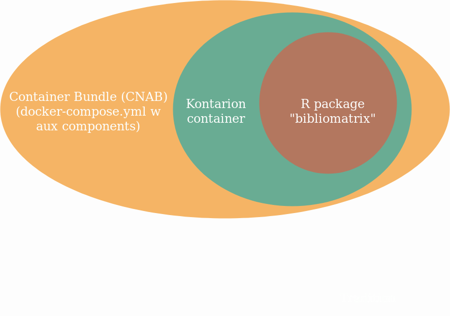

##

{.width=600px}

## Delivery components

Containers - "units" that can be bundled together into "systems".

- Binaries - Package a solution as (bundle of) units (Docker + Docker Hub)
- Versions - latest or pinned version (dev, ref, prod)?

## Procedures / routines

.. for Operations, Maintenance, Troubleshooting

  - Updates to data (bundled data, caches)
  - Steps for deploying updates to components
  - Troubleshooting incidents and using logs
  - FAQs and recipes
  - Load testing
  - Monitoring
  - Usage reporting
  
## Existing documentation

- Overview at https://kth-library.github.io/ - maintained [here](https://github.com/KTH-Library/KTH-Library.github.io)
- Components:
  - R-package: https://github.com/KTH-Library/bibliomatrix
  - R-package: https://github.com/KTH-Library/ktheme
  - Container: https://github.com/KTH-Library/kontarion
  - Bundle: https://gita.sys.kth.se/kthb/kontarion-bundle
  
## Suggested updates to docs

- Create a FAQ to put on https://kth-library.github.io/
- Update the system's overview to reflect current "kontarion-bundle" setup
- Provide introductory description - What happens where and in which steps?
  - Which services does what? Purpose of a service?
  - What data volumes or environment variables are important?
  - Which servers are in use? dev (shiny-1), ref (shiny-2), prod (new)
- Which steps are needed for a deploy of kontarion? 

## Suggested workshops

- Using docker, running locally w a) "hello world" app b) kontarion
- Procedures w steps required when adding more new components, such as...
  - A hello world app - not authenticated, provided in a folder w some standalone files
  - A new app, added to ABM, authenticated?
  - Another app packaged as an R package?
