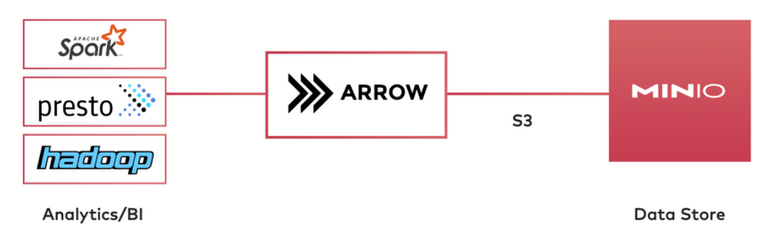
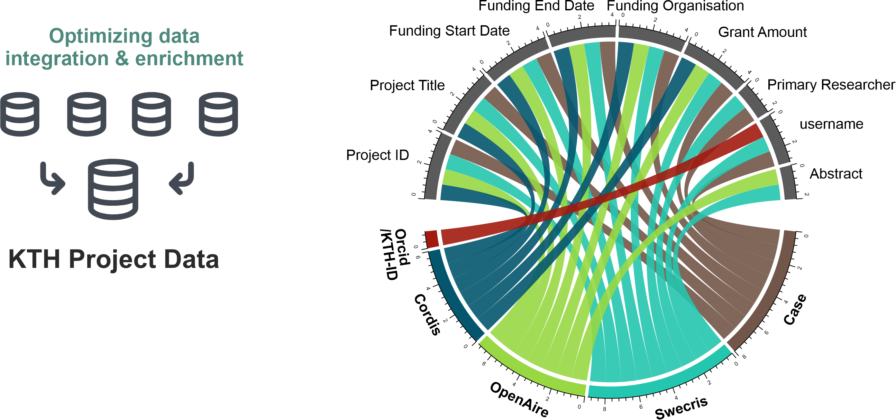
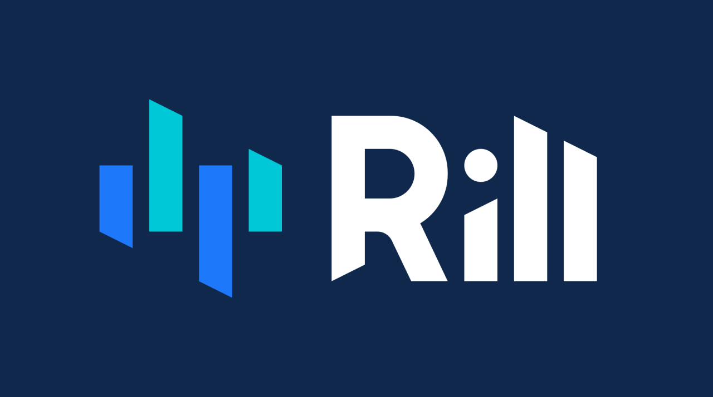
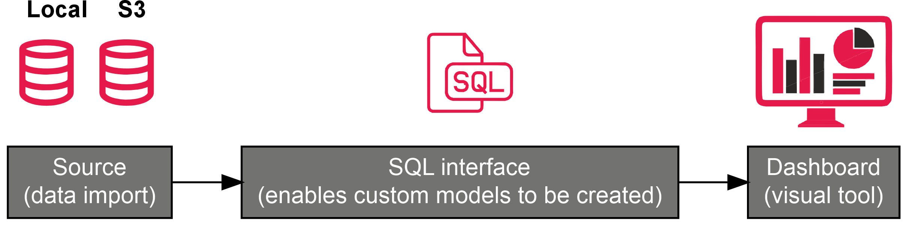

  
```{r setup, include=FALSE, warning=FALSE}
knitr::opts_chunk$set(echo = FALSE)

library(DiagrammeR)
library(dplyr)
library(DT)
library(kthcorpus)
library(readr)
library(DiagrammeRsvg)
library(magrittr)
library(gt)
library(purrr)
```

## Agenda

- <span class="grey-header">Recall and Review</span>
- <span class="grey-header">Relational data table (kopplingstabell)</span>
- <span class="grey-header">Rill Developer (Demo)</span>

    - <span class="maroon-text" style="color: #DE3163;">Concept</span>

    - <span class="maroon-text" style="color: #DE3163;">How it can be leveraged to answer project-related questions.</span>

## Recall and Review {.smaller}

- <span class="grey-header">“**Which projects are active? Which researchers are involved? From which organisations? Grant sizes?**</span>

- <span class="grey-header">**What we have accomplished so far:**</span>

</br>

:::: {style="display: flex;"}

::: {}
- <span class="maroon-text centered-text" style="color: #DE3163;">Accessed and collected data via APIs</span>
- <span class="maroon-text centered-text" style="color: #DE3163;">Mobilized data for KTH projects using Object Storage (S3)</span>

{height=100}
:::

::: {}
- <span class="maroon-text" style="color: #DE3163;">Conducted Exploratory Data Analysis & String Matching:</span>

{height=200}
:::

::::

</br>

## KTH Project Data Sources

- <span class="grey-header">Data records as of 2023-08-28</span>
- [Check out our landing site](https://bibliometrics.lib.kth.se/RI_sources_KTH.html)

```{r echo=F}
tribble(
  ~source, ~url, ~open, ~download_url, ~repo_url, ~rows, ~cols, ~freq,
  "Formas", "https://formas.se/en/start-page/about-formas/what-we-do/open-data---api-containing-information-on-funded-projects/documentation-for-api-containing-information-on-funded-projects.html", TRUE, "projects_formas.csv", "formas", 478, 21, "daily",
  "OpenAIRE", "https://graph.openaire.eu/develop/api.html#projects", TRUE, "projects_openaire.csv", "OpenAIRE", 901, 10, "daily",
  "Swecris", "https://swecris-api.vr.se/index.html", TRUE, "projects_swecris.csv", "swecris", 3204, 26, "daily",
  "Vinnova", "https://www.vinnova.se/en/about-us/about-the-website/open-data/", TRUE, "projects_vinnova.csv", "vinnova", 463, 20, "daily",
  "CORDIS", "https://data.europa.eu/data/datasets/cordis-eu-research-projects-under-horizon-europe-2021-2027?locale=en", TRUE, "projects_cordis.csv", "cordis", 753, 20, "monthly",
  "CASE", "https://confluence.sys.kth.se/confluence/pages/viewpage.action?pageId=70785591", FALSE, "", "bibliotools", 3073, 40, "daily"
  ) |>
  mutate(open = ifelse(open, "🟢", "🔒")) |>
  mutate(repo_url = sprintf("<a href='https://github.com/KTH-Library/%s' target='blank'>%s</a>", repo_url, repo_url)) |>
  mutate(source = sprintf("<a href='%s' target='blank'>%s</a>", url, source)) |>
  mutate(download_url = ifelse(nzchar(download_url) < 1, "<a href='https://data.bibliometrics.lib.kth.se' target='blank'>Authenticated S3 bucket</a>", glue::glue("<a href='https://data.bibliometrics.lib.kth.se/kthcorpus/{download_url}' target='blank'>{download_url}</a>", .na = NULL))) |> #, download_url, download_url)) |>
  select(-url) |>
  DT::datatable(escape = F, rownames = F, colnames = c(
    Source = "source",
    Access = "open",
    Download = "download_url",
    Tools = "repo_url", 
    Records = "rows",
    Fields = "cols",
    Updates = "freq"
  ), options = list(dom = ""))
```

## Relational data table

- Method --- Approximate and exact string matching but also probabilistic record linkage
- Strength --- jaro-winkler similarity index

- Usage --- multi-purpose use e.g., enrich and harvest data from other sources

```{r warning=FALSE,message=FALSE}
project_links <- minio_get("project_links.csv","kthcorpus") |> read_csv()

project_links |> 
  slice_head(n = 2) |>
  DT::datatable(style = "bootstrap4",autoHideNavigation = F,escape = T)
```

## Rill developer

<span class="grey-header">Rill Developer <https://www.rilldata.com/> is a fast-feedback IDE and analysis tool that transform data tables into Rill dashboards, powered by [DuckDB](https://duckdb.org/).</span>

### Strengths 

- Computationally highly efficient (e.g., basically no run time).
- Offers many features to explore time-series and data quality.
- Importantly, it does not require hard-coded efforts on the part of the user (e.g. R, Python).

### Weaknesses

- Restricted visual capabilities.
- Presupposes working knowledge of Structured Query Language (SQL).

## The nitty-gritty of Rill

<center>
{height=200,width=200}
<center>

</br>

<center>
{height=200,width=200}
<center>

```{r}
# DiagrammeR::grViz("
#  digraph {
#
#    graph [rankdir = LR]
#    node [shape = rectangle, style = filled, fillcolor = 'lightblue', fontname = 'Arial']
#
#    A [label = 'Source\n(data import)', fontname = 'Arial', fontsize = 12]
#    B [label = 'SQL interface\n(enables custom models to be created)', fontname = 'Arial', fontsize = 12]
#    C [label = 'Dashboard\n(visual tool)', fontname = 'Arial', fontsize = 12]
#
#    A -> B
#    B -> C
#  }
#") 
```

## Demo
- <span class="grey-header">Making sense of Case and other source $\rightarrow$ Let's check it out!</span>
- <http://localhost:9009/>

- <span class="grey-header">We will look at how to use Rill to explore project data and how we can use our relational data table to 1) determine project overlap and difference across different data sources; and 2) quickly visualize select features using basic time-series tools.</span>
