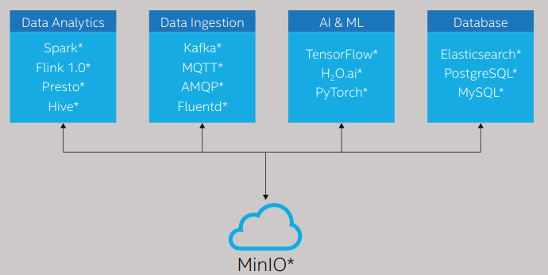
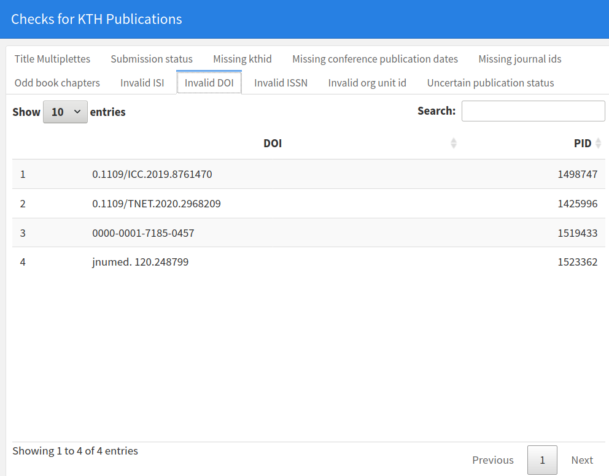

  
```{r setup, include=FALSE}
knitr::opts_chunk$set(echo = FALSE)

library(ktheme)
library(webshot)

red <- function(txt) 
  sprintf("<font color='%s'>\n%s\n</font>", tolower(palette_kth()["cerise"]), txt)

#webshot::install_phantomjs()
#unlink("retrosearch-screenshot.png")

suppressPackageStartupMessages(library(magick))

# BG images that could be used

```

## Corpus Data for KTH

> A sketch for how to work with data management for KTH Corpus data, using existing data sources.

In summary, for corpus data from KTH, we are integrating data flows to support data curation based on various (internal and external) sources. 

- Data flows into "object storage".

- From there it flows out to applications, APIs and data management tools.

## Object Storage

{height=300}

Data is made available through "object storage" to data processing backends such as Apache Spark, Neo4J and traditional databases.

## Data Sources

Data integration involves a range of data sources:

Internal:

- [KTHs DiVA data](https://gita.sys.kth.se/kthb/diva) (publications and authors)
- [HR data from KTH](https://gita.sys.kth.se/kthb/diva)
- [KTH APIs](https://github.com/KTH-Library/kthapi)
- [Bibliometric data from KTH](https://github.com/KTH-Library/bibliomatrix) (data used from ÅBU, from BIBMON, BIBMET in MSSQL etc)

> Additional added as required.

## Data Sources (continued...)

External (Cross-referencing):

- [Semantic Scholar](https://github.com/KTH-Library/semanticscholar) - KTH is now a partner and has API access with good rate limit
- [SwePub]() - beta-code availble, needs integration with https://github.com/KTH-Library/kthcorpus
- [SweCRIS](https://github.com/kth-library/swecris) - Swedish "aggregator", including DiVA-data for KTH
- [CORDIS](https://github.com/KTH-Library/cordis) - EU-supported R&D activities, including programs, projects, results and publications
- [ROR](https://github.com/KTH-Library/institutions) 

> Additional added as required

## Tooling for data curation

Data curation tooling:

- Object Storage for data (using https://min.io)
- Support for data curation using Apache Spark and Neo4J in addition to existing tools
- Web-enabled data management environment, with `kthcorpus` tools including `bibutils`

{height=300}

## Current progress / Steps

- Move "diva"-package to GitHub, rename to "kthcorpus" and enable CI

- Manage tickets/changes in GitHub Projects for this effort

- Include it in `kontarion` and schedule automatic jobs for data flows


- Deploy "kthcorpus" package including APIs/apps to allow integrations against DiVA-"apan" and other applications, for example against https://bibliometrics.lib.kth.se/corpus/api

- Extend existing "checks" (various data quality assertion on the corpus data) in collaboration with KTHB

- Add UptimeRobot monitoring and _monitoring endpoint for KTH Operations monitoring

## Data Curation Workshops

- How to use object storage for integration of data flows

- Working with "big data" formats (parquet, arrow etc over S3)

- Working with neo4j for graph data

- How to use data from traditional relational databases such as MSSQL

- Harvesting data and "data wrangling"- working with Arrow and S3 data, Clickhouse (if needed) and Neo4J w Cypher query language and Apache Spark w SQL syntax

## Factors

What are factors to consider?

- Open source and community size (no license fees/costs, support communities etc)
- Performance and flexibility (reproducible environments, containers)
- "Learnability" / simplicity 
- Complexity of full stack
- Team skills/competencies
- Resource needs given the nature of the data (server maintenance etc)

## Timeline / estimation

To build solid data curation support for KTH Corpus Data, including workshops for building team skills, a timeline estimate for having it up and running smoothly is end of August this year (ie approx 4 months)

This leaves room for agile adjustments based on requirements and needs.
