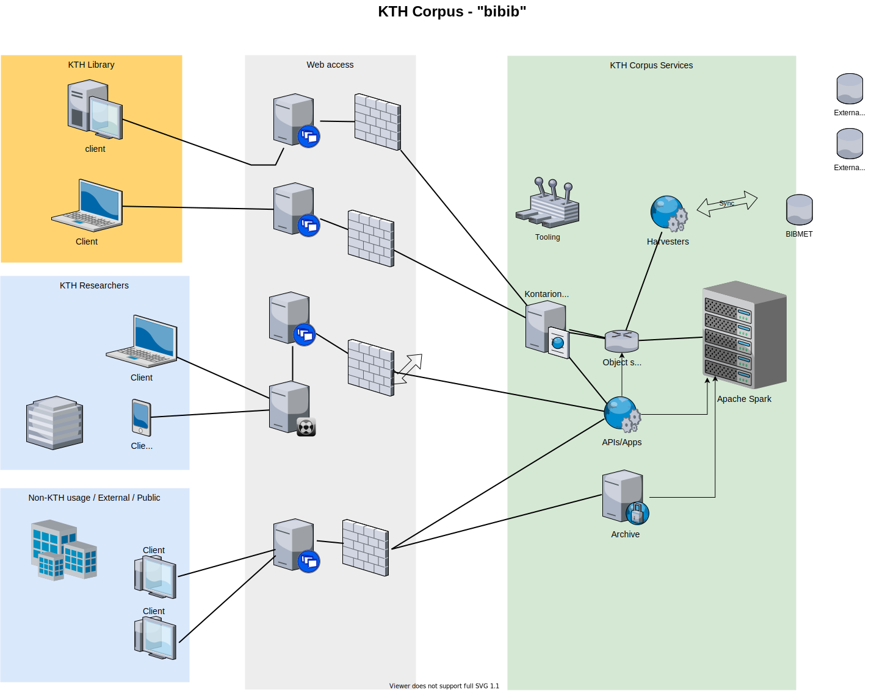

## Considerations

- Support **data curation and QA checks** for KTH Corpus data through automation and tooling allowing batch updates
- Support **existing dataflows** with ability to feed to BIBCAP/BIBMET; sync to MSSQL
- Use automated data flows / **harvesters** to mirror / harvest relevant slices for data integration
- Offload some analytical processing (heavy reads and calculations) to **columnar dbs**
- Deal with bigger data and support portable data export formats such as **parquet**
- Access from R / Python and other environments w support for **SQL and Cypher**
- Hybrid cloud deployments -> container based object storage **https://min.io**

## Column-oriented analytics backends

Click below for links to column-oriented analytics data engines Apache Spark, DuckDB and Clickhouse, which all checks the boxes on the wishlist: 

[{width=100}](http://spark.apache.org/)
[{width=100}](https://duckdb.org/docs/why_duckdb)
[{width=100}](https://clickhouse.tech/)

These are SQL-compatible, open source and widely used for analytics, and available for containers and embedding. For graph/network analytics and CYPHER queries:

[{width=100}](https://neo4j.com/) with extensions for neosemantics, graph data science and "apoc".

# Suggestion to support data flow needs

## Stakeholders and gateways

Different stakeholders:

- Consumers of data - KTH researchers/staff (authentication w OIDC or SAML)
- Producers of data - KTH Library staff (db connections, API access)
- "General Public" - open data (get to public data, data archives)

Gateways/access:

- Apps, APIs and data assets ("archives" of data dumps, reports)
- Toolbox for data curation

## Managing data flows

> See overview/diagram at https://kth-library.github.io/open-datascience-platforms/#20 - Batch/bulk changes based on KTH DiVA data (QA work etc) can be written back to KTH curated data source, and exposed to global aggregators (SwePub, Semantic Scholar etc)

- Data integration infrastructure component Apache Spark for data integration against several sources

- Data processing components to meet specific needs, such as dockerized neo4j setup with neosemantics, gds and apoc, with CLI tools like neo4j-admin which allows bulk loading, from "diva" R-package

- "Jobs" / processes to sync data, using "harvesters" to automate scheduled data flows from data sources into data backend

- Tools such as "diva" R package bundled in "kontarion" stack

##

{height=500}

## 

{height=400;}

[The overview.drawio file can be edited at https://app.diagrams.net/](bibib.drawio)

## KTH Corpus API 

{height=400}
See Trello ticket [here](https://trello.com/c/PTzp0VYm/458-data-quality-curation-tool-for-publication-data)

## Suggested steps (1)

- Change "diva" R-package to have a broader scope -> "bibib" or "kth-corpus"
  - Rename to signal wider scope
  - Include data for KTH-researchers, such as hrplus data management support
  - Include additional reference data for example from UKÄ
  - Include integration with KTHB python utils (see kthb_reticulate.R)
  - Add more checks (for example age, UKÄ codes 2011+)
  - Support other integrations with in-house apps/tools/services, such as "DiVA apan"...

## Suggested steps (2)
  
- Integrations with open source data wrangling tools
  - Include in "kontarion" for web-based IDE
  - Include neo4j bulk extract functionality
    - Provide docker image with neo4j db (server)
    - Tooling: use https://neo4j.com/download/ Neo4J Desktop (frontend)
  - Additional web-enabled data management tool support

- Schedule data flow jobs
  - Daily job to sync (incoming and outgoing) / harvesters
  - Add scheduled reports (such as in the "diva" R-package API)

## Demo of existing tooling

- `diva`, at https://gita.sys.kth.se/kthb/diva, could be deployed in a similar way, has a draft API included

- neo4j with KTH corpus data (publications, authors)

- `cordis`, at https://github.com/KTH-Library/cordis, deployed at https://shiny-2-r.referens.sys.kth.se/ide using "kontarion" base image

- `duckstream.R`, at https://gist.github.com/mskyttner/46601e60138a886cdfbfc81067c71725, allows to stream data to parquet

- Using Apache Spark - see `repos/auth0poc/import_spark_simplified.R`

## Missing pieces

- A data backend server for hosting Apache Spark
  - https://blog.min.io/modern-data-lake-with-minio-part-1/
  - https://blog.min.io/modern-data-lake-with-minio-part-2/

- Object storage, using https://min.io (for more info see https://min.io/product/integrations)

## How to use MSSQL SPs in apps/APIs

- Suggestion: harvesters and/or connection -> Apache Spark [w MS SQL Server connector](https://docs.microsoft.com/en-us/sql/big-data-cluster/sparklyr-from-rstudio?view=sql-server-ver15)
- Harvesters can work with Parquet, CSV, JSON from APIs or data from S3 or file storage
- Or with dbconnection: https://github.com/microsoft/sql-spark-connector and sparklyr::spark_read_jdbc()
- API (python/R) can now connect to and expose data from Apache Spark or parquet exports (and from other data sources/APIs etc)
- Allows scaling up and can run in hybrid cloud deployments
