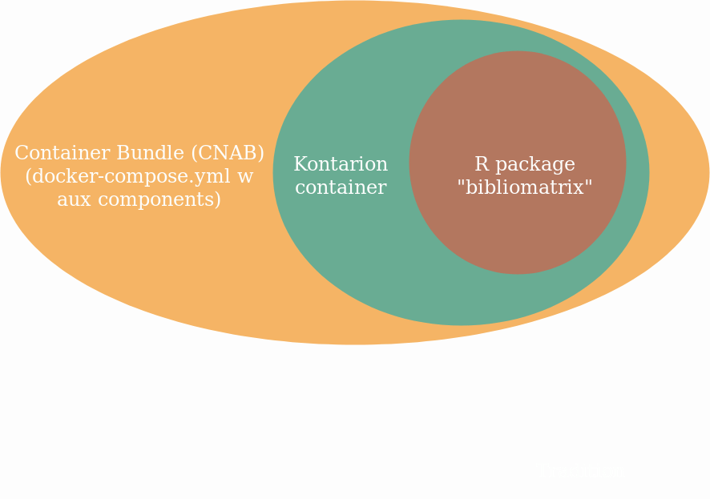
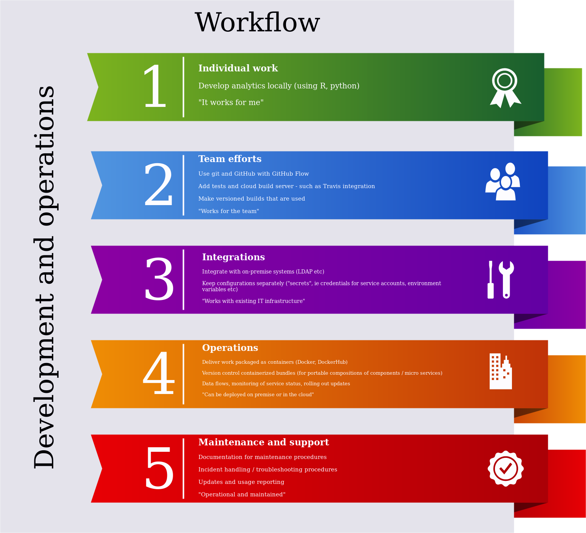

##

{.width=600px}

## Collaborative work

- How package team collaboration efforts
  - Packages are "units of work" with functionality, apps, data, APIs
  * R package - for a great reference see https://r-pkgs.org
  * Similarly for work made with python, JS etc (shared libs, packages)
  
- Where do I put stuff in the R package project?
  - Shiny app, Flexdashboard, API: use `inst/shiny, inst/extdata, inst/plumber`
  - Vignette: use `vignettes`
  - App data: use `rappdirs`
  - Data: is it external (documented) or internal?

## Tools and workflows

- What tools and workflows can we use to support team collaboration?
  * git, RStudio
  * GitHub with GitHub Flow: https://guides.github.com/introduction/flow/
  * Not restricted to in-house / on-premise collaboration
  * Can bundle python work using these tools
  

 
## Workflows for R packages

- What are the steps during various development and operations stages?
  * Iterations during package development
  * Releasing a new package version
  * Rolling out through the deployment pipeline
  * Testing (sanity, load, integrations, etc)
  * Checklist aligning with KTH release process 

## 

{width=600px}

## Making changes to an R package

- How to make a change in the "bibliomatrix" R package?
- How to document new functionality?
  * Functions
  * Bundled data (open?)
  * Articles/tutorials/vignettes and other documentation (pkgdown)
- What does continuous integration with Travis provide?
  * Badge for "build passing"
  * The .travis.yml file
  
## Workflow for a change

- Different kinds of changes
  * Commit (small changes all the time)
  * Push (upload a set of commits, run Ctrl-Shift-{D,T,E} first and (quirk) due to build server
  * Pull request (ask for acceptance/review and incorporate into master)

## Making a change / pull request 
  
- A "pull request" ie "change" at GitHub (PR/MR/CR - "merge", "change")
  * Requesting a review from someone else (acceptance)
  * Pulling changes into a feature branch (`git pull origin master`)
  * Quirks - add docs built locally due to cloud build server not having access to closed source data (`devtools::build_vignettes(); pkgdown::build_site()`)
  * Merging a pull request (`git pull origin master` and use `meld` if conflicts)

## Nice R code

- How to create a user-friendly and nice function?
  - Repetitions -> use a function to avoid repetitions?
  - Functions that call functions?
  - How to pass arguments?

## Functions

- What is a good reference when designing functions?
  - "Advanced R" book by Hadley Wikham - online here: https://adv-r.hadley.nz/
  - See especially https://adv-r.hadley.nz/fp.html about functionals, function factories and function operators
  - Don't dive into the OO design patterns (my personal opinion)
  
## Inspiration
  - Look at existing great packages (all open source) from tidyverse efforts
  - An example of a function with a huge number of arguments: https://github.com/ropensci/rgbif/blob/master/R/occ_data.R#L23
  - Some recommendations: https://www.r-bloggers.com/function-argument-lists-and-missing/

## State management

- Managing state and cleaning up
  - Database connections are "costly" to create (take time), reuse existing with "pool" package
  - Look at exit handlers at https://adv-r.hadley.nz/functions.html
- Packages have their own "environments"
  - Scoping
  - Where should a pooled connection live?

## Example 1

Adding a flexdashboard with a collapsible tree to be used for navigation

- git clone the bibliomatrix repo
- open the project file in RStudio
- add a branch for the work
- where [could a flexdashboard go](https://stackoverflow.com/questions/30377213/how-to-include-rmarkdown-file-in-r-package#30377598)?
- once you have determined a good location, add a file there and author the content, use data from [`unit_info()`](https://kth-library.github.io/bibliomatrix/reference/unit_info.html)
- can you add a test?
- commit, push, request a review on for that branch @ GitHub

## Example 2

Adding tests for verifying calculations

- same as above, basically, but ...
- `usethis::use_test("abm")` for the location of the file
- work on the tests, commit regularly and push
- request a review when you want input from others
- conversation and collaborative efforts become visible on GitHub
