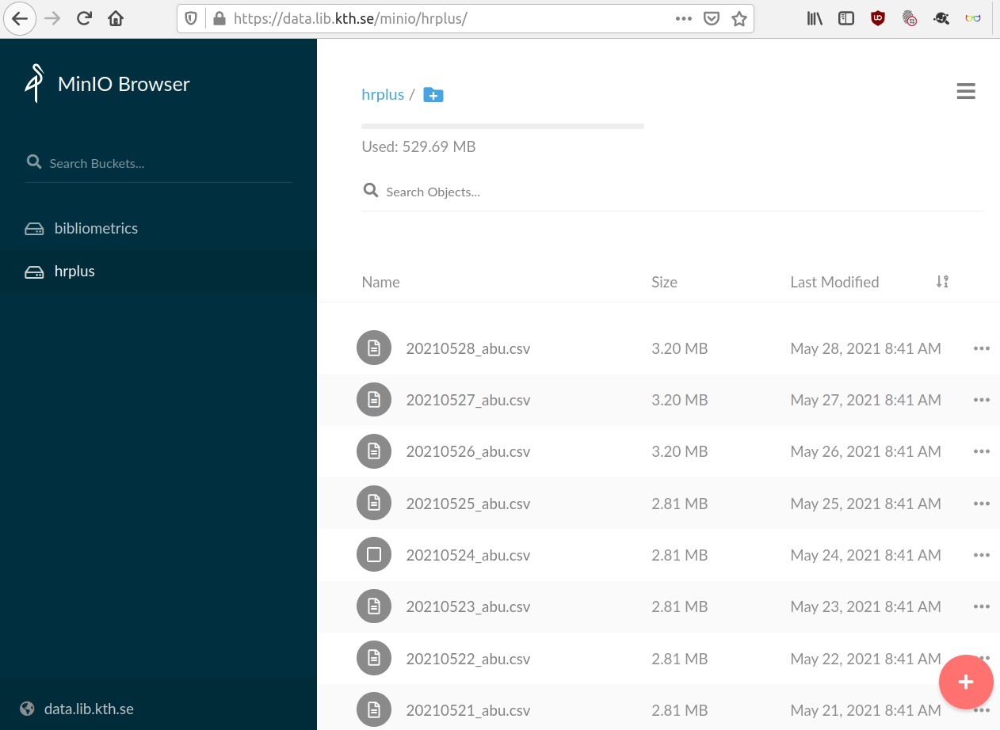
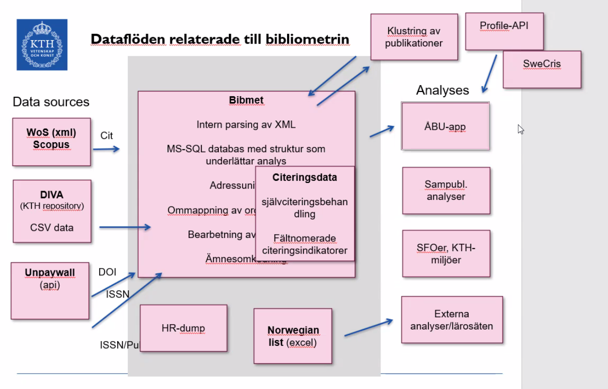
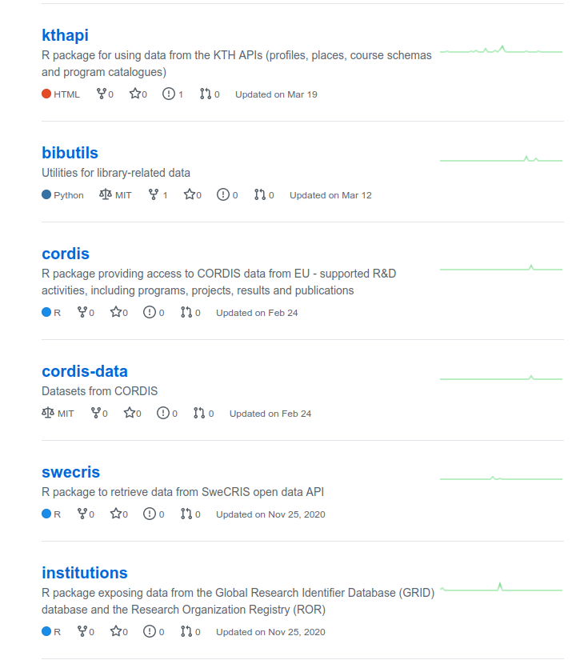

  
```{r setup, include=FALSE}
knitr::opts_chunk$set(echo = FALSE)

library(ktheme)
library(webshot)

red <- function(txt) 
  sprintf("<font color='%s'>\n%s\n</font>", tolower(palette_kth()["cerise"]), txt)

#webshot::install_phantomjs()
#unlink("retrosearch-screenshot.png")

suppressPackageStartupMessages(library(magick))

# BG images that could be used

```

## Mini-hackathon {data-background=assets/bg/kth-6.png data-background-size=cover}

The first time we meet in this setting (first deep dive into DiVA/Inveno):

- Gaël Dubus, Anders Wändahl, Sam Al-Arbid, Nazar Dino, Markus Skyttner

Discussion points:

- When doing analyses of research outputs from KTH, what would be an ergonomic data flow?
- What system is most suitable as a primary/main data source for research outputs / publication metadata?
- What can data about research outputs be used for at KTH?

## What do we need for supporting an ergonomic data flow for analysing?

Depending on the analyst or user, different functionality is required:

- Researcher: Good Web UI for data entry for researchers, to maintain and update
- Analyst: APIs for system integrations and automatable workflows 
- Analyst: Toolbox / utilities for using and combining data in analysis
- ITA: Reliable components that can be adapted to workflows at KTH

## Main data source for research outputs -- currently DiVA

Current DiVA - future Invenio ... probably?

The current DiVA repository have some strength and present some challenges:

- Used nationally in many institutions
- API lacking, slow progress towards CORA (DiVA API v3)
- Difficult to extend for KTH specific purposes

## Future: Invenio

Invenio have some strengths in areas where DiVA does not:

- Invenio is similar to Zenodo, but more flexible, so known "globally"
- Good API, documentation
- Global community, actively maintained
- Extensible with custom fields
- Support for links / minted DOIs
- Presentation / GUI can be customized (can we make it look like DiVA, do we even want this?)
- Control over the data and the system, more empowered to quickly make adjustments
- Adapted by other institutions
- Comply to EU-standards for open data, a regional/global community

## Utblick - dataflöden & tjänster

- Vad är poängen med dataflöden?  
    - transparens & tillgänglighet
    - reproducerbarhet
    - analytics
    - standardisering

<!-- {height=200px} -->


## Exempel på dataflöde

- Infrastruktur   
  - Datatillgänglighet
  - Mellanlager för data (S3)
  - Knyta samman datakällor

<center>
{height=300px}
</center>

{height=500px}
## Andra tillgängliga datakällor

<center>
{height=500px}
</center>
