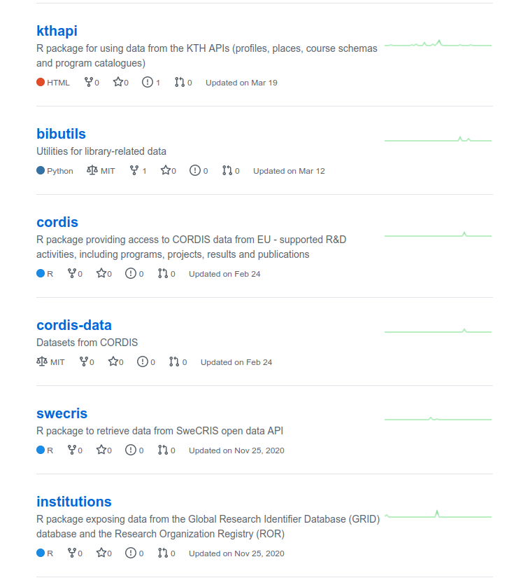

  
```{r setup, include=FALSE}
knitr::opts_chunk$set(echo = FALSE)

library(ktheme)
library(webshot)

red <- function(txt) 
  sprintf("<font color='%s'>\n%s\n</font>", tolower(palette_kth()["cerise"]), txt)

#webshot::install_phantomjs()
#unlink("retrosearch-screenshot.png")

suppressPackageStartupMessages(library(magick))

# BG images that could be used

```

## Agenda

- ÅBU-appen (10 min)
- Dataflöden (10 min)
- Gruppdiskussion i smågrupper (15 min)
  - Vilka dataset/dataflöden använder du som vore intressanta att samköra med det som visats?
  - Vilka rutinmässiga underlag, analyser och rapporter producerar du som vore intressanta att automatisera?
- Presentation av gruppdiskussion (3 min per grupp)
  - Summering & uppsamlande diskussion

<!--
https://intra.kth.se/itm/nyheter/mikael-ostling-rankingens-krigare-1.1075812 
-->

## Bakgrund & bibliometrisk användning

**Exempel på användning av bibliometriska data:** 

- Resursfördelning (nationellt och inom KTH)
- Ranking
- Uppföljning inom KTH
- RAE
- Projektansökningar

**Leveranser**:  

- Rapportunderlag
- ÅBU (app)
- Besvara skräddarsydda analysförfrågningar

# Demo av ÅBU-appen

- Årlig bibliometrisk uppföljning: [ÅBU/ABM](https://kth.se/abm)
- Personalbaserad ÅBU: [authorbased ABM](https://bibliometrics.lib.kth.se/beta/authorbased)

## Data för verksamhetens behov

- Datakällor - Strukturerade data inom och utanför KTH

- Dataflöden - Hur flyttar/reser data inom organisationen eller för olika behov?
  
- Dataklasser / entiteter - Används som noder vid analys eller för att knyta ihop data
  - **Forskare**
  - **Organisationer på KTH**
  - **Publikationer**
  - **Indikatorer**
  
## Dataflöden i ÅBU-projektet

{height=500px;align='middle'}

## Externa datakällor

{height=500px}

## Gruppdiskussion (15 min)

"Break-out rooms" i Zoom, med frågeställningar:

- Vilken data använder du som vore intressant att samköra eller kombinera med det som visats?

- Vilka rutinmässiga underlag, analyser och rapporter producerar du som vore intressanta att automatisera?

Grupperna modereras av Pernilla, Maria, Sofi, Agne, Gaël, Tobias och Markus.

> Förbered i gruppen en 3 min presentation av diskussionerna.

# Presentation av gruppdiskussion och summering


## Utblick - dataflöden & tjänster

- Vad är poängen med dataflöden?  
    - transparens & tillgänglighet
    - reproducerbarhet
    - analytics
    - standardisering


<!-- {height=200px} -->


## Exempel på dataflöde (data om forskare från HR)

- Infrastruktur   
  - Datatillgänglighet
  - Object storage (S3)
  - Knyta samman datakällor
  
{height=500px}

#

##

{height=500px}
