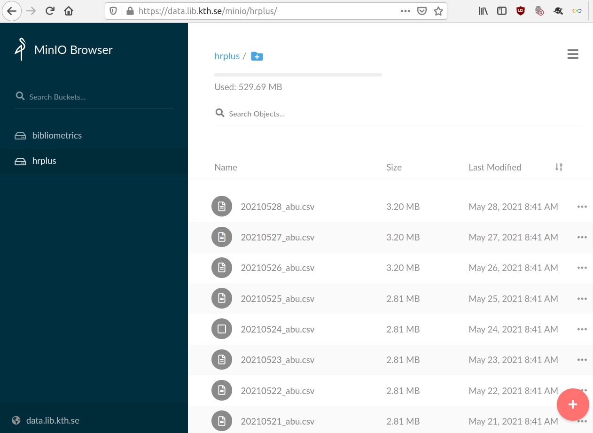
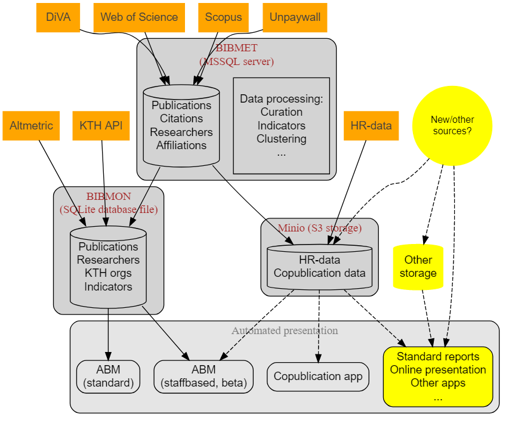
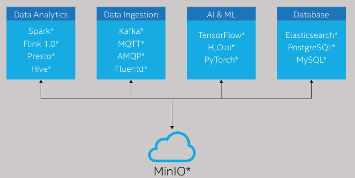
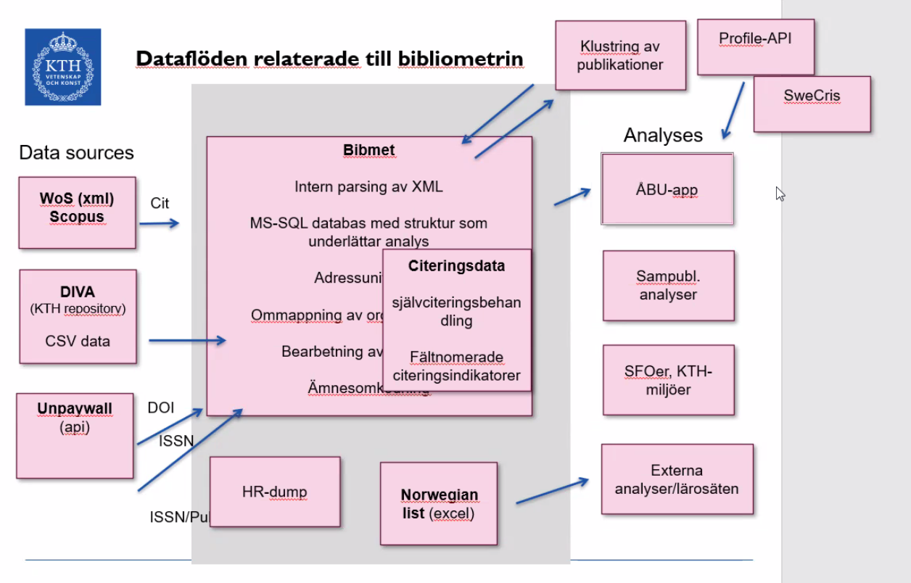

  
```{r setup, include=FALSE}
knitr::opts_chunk$set(echo = FALSE)

library(ktheme)
library(webshot)

red <- function(txt) 
  sprintf("<font color='%s'>\n%s\n</font>", tolower(palette_kth()["cerise"]), txt)

#webshot::install_phantomjs()
#unlink("retrosearch-screenshot.png")

suppressPackageStartupMessages(library(magick))

# BG images that could be used

```

## Agenda

- ÅBU-appen
- Dataflöden
- Gruppdiskussion i smågrupper
  - Vilka dataset/dataflöden använder du som vore intressanta att samköra med det som visats?
  - Vilka rutinmässiga underlag, analyser och rapporter producerar du som vore intressanta att automatisera?
- Presentation av gruppdiskussion
- Summering & uppsamlande diskussion

<!--
https://intra.kth.se/itm/nyheter/mikael-ostling-rankingens-krigare-1.1075812 
-->

## Bakgrund & bibliometrisk användning

**Exempel på användning av bibliometriska data:** 

- Resursfördelning (nationellt och inom KTH)
- Ranking
- Uppföljning inom KTH
- RAE
- Projektansökningar

**Leveranser**:  

- Rapportunderlag
- ÅBU (app)
- Besvara skräddarsydda analysförfrågningar

# Demo av ÅBU-appen

- Årlig bibliometrisk uppföljning: [ÅBU/ABM](https://kth.se/abm)
- Personalbaserad ÅBU: [authorbased ABM](https://bibliometrics.lib.kth.se/beta/authorbased)

## Data

- Datakällor  
  Strukturerade data inom och utanför KTH

- Dataflöden   
  Hur flyttar/reser data inom organisationen eller för olika behov?
  
- Dataklasser / entiteter  
  Används som noder vid analys eller för att knyta ihop data
  - Forskare
  - Organisationer på KTH
  - Publikationer
  - Indikatorer
  
- Analysbehov  
 "Slutanvändare"; är beroende av data och fungerande dataflöden för att besvara frågeställningar 

## Exempel på dataflöde (data om forskare från HR)

{height=500px}

## Dataflöden i ÅBU-projektet

{height=500px}
Lägg till Github-bild av repon

## Utblick - dataflöden & tjänster

- Vad är poängen med dataflöden?  
    - transparens & tillgänglighet
    - reproducerbarhet
    - analytics
    - standardisering
- Infrastruktur   
  - Datatillgänglighet
  - Object storage (S3)
  - Knyta samman datakällor

<!-- {height=200px} -->

## Gruppdiskussion

  - Kan vi komplettera vår app eller andra appar med era datakällor?
  - Vilka manuella analyser kan automatiseras på liknande sätt?
  - Vilka data har ni att dela med oss (som kopplar KTHs grundenheter; kthid, org-sluggar etc)?

##


#

##

{width=800;}

##

{height=500px}

## Exempel på dataflöde

- Lägg upp data
- Använd i en app


  
## Automatiserade analyser

## Summering

Presentation av gruppdiskussion
